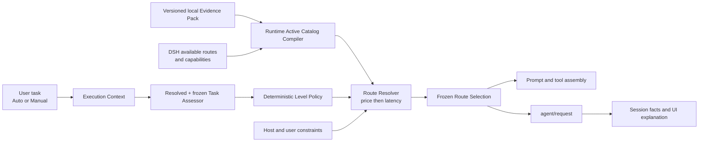

# System architecture

[简体中文](zh-CN/architecture.md)

## Status

Accepted direction under ADR-011 through ADR-014. Verified DSH seams and fork requirements remain recorded in [DSH integration evidence](dsh-integration.md).

## Principles

1. Deterministic policy in the DSH Host owns normal route decisions.
2. Artificial Analysis supplies external capability, price, and latency data; it does not see the task or emit the final route.
3. A versioned assessor policy resolves and freezes one environment-valid classifier route; that Task Assessor emits structured task properties, never a model name.
4. User-facing handling levels are `light`, `standard`, and `deep`; they are heuristic allocation levels, not quality guarantees.
5. Executable Host route identity and AA evidence identity remain separate; explicit versioned bindings connect them without a universal variant/effort ontology.
6. Host capability and user constraints filter candidates before price comparison.
7. One model call consumes one frozen selection across provider-dependent assembly and `agent/request`.
8. Persisted Session facts, not transient UI state, are the source of truth for what Auto selected and why.

## Components



### AA Evidence Pack

The local Evidence Pack contains four independently versioned, validated, and SHA-256-digested components: `aa-snapshot/v2`, `aa-binding-registry/v1`, `aa-route-policy/v1`, and `aa-evidence-pack-manifest/v1`. The Snapshot scans every acquired page and retains every unique record with valid policy capability and price, regardless of current Host inventory or binding availability. The Registry holds provider normalization rules and durable exact mappings; the Manifest binds component digests, `aa-evidence-pack-runtime/v1` compatibility, and rights mode.

The maintained synthetic shape is illustrated by [`examples/aa-evidence-pack.example.json`](../examples/aa-evidence-pack.example.json). Real acquisitions, packs, reports, rollback artifacts, credentials, and grant documents stay under the Git-ignored `local/` directory in `internal-only` mode. Runtime never calls AA. The private file boundary enforces path containment, bounded JSON, mode `0600`, component and predecessor digests, atomic replacement, and validated rollback.

### Host Route Identity Builder

Materializes each DSH route's executable identity before catalog matching:

```ts
interface HostRouteIdentity {
  routeId: string
  provider: string
  model: string
  effectiveConfigFingerprint: string
}
```

The fingerprint covers every Host-materialized request option that can change execution semantics. Reasoning effort is optional and provider-owned. Two routes with different effective configurations cannot share an identity even when their model names match.

### Evidence Route Identity and Binding Registry

The complete execution identity remains independent from the reusable evidence identity:

```ts
interface EvidenceRouteKey {
  schemaVersion: 1
  providerNamespace: string
  modelKey: string
  evidenceControls: Readonly<Record<string, string | number | boolean>>
}

interface AAEvidenceBinding {
  evidenceRouteKey: EvidenceRouteKey
  aaRecordId: string
  ruleVersion: string
  matchBasis: readonly string[]
  limitations: readonly string[]
  quarantine: null | { reasonCode: string }
}
```

Each provider rule declares exact provider IDs, model aliases, and only the controls that select a distinct AA evaluated record. No control is universally required. A rule may also declare `aaRecordMappings` from stable AA record IDs to canonical model keys and evidence controls. During refresh, `aa-binding-candidate-compiler/v1` materializes a new binding only when that exact stable record exists and its EvidenceRouteKey is unoccupied; an identical reviewed binding is reused, while missing, conflicting, or cross-rule ambiguous declarations are isolated as AMBER. The compiler does not inspect Host availability and never consumes record names, slugs, similarity, discovery order, or a guessed latest record. A binding is active when a current Host route derives its exact key, dormant when no route does, and quarantined when a semantic integrity exception prevents use. Snapshot refresh changes metrics without rewriting stable bindings.

### Runtime Active Catalog Compiler

For each user turn, Runtime validates the compatible Evidence Pack, materializes the current DSH routes, derives exact EvidenceRouteKeys, intersects them with non-quarantined Registry bindings and present Snapshot records, then applies Route Policy. The Active Catalog is a deterministic runtime value, never a maintained or distributed artifact:

```ts
interface AAEvidenceCatalogEntry {
  routeId: string
  provider: string
  model: string
  effectiveConfig: Readonly<Record<string, unknown>>
  effectiveConfigFingerprint: string
  evidenceRouteKey: EvidenceRouteKey
  evidenceRouteKeyId: string
  aaSnapshotId: string
  aaRecordId: string
  bindingRegistryVersion: string
  evidenceBinding: AAEvidenceBinding
  aaRecord: Readonly<Record<string, unknown>>
}

interface AAEvidenceCatalogExclusion {
  source: 'host-route' | 'binding'
  hostRouteId?: string
  bindingIndex?: number
  reasonCode: string
}
```

Malformed, unbound, quarantined, missing-record, or incompatible routes are excluded with stable reason codes without invalidating unrelated routes. Entries, binding states, and exclusions are sorted deterministically. A newly added Host route activates immediately when its exact dormant binding and current record exist; execution-only default changes alter the ExecutionFingerprint but preserve the EvidenceRouteKey.

The completed Phase 1 policy compiler emits frozen entries with `handlingLevel`, `aaCapabilityScore`, `aaPrice`, and nullable `aaLatencySeconds`. `aa-route-policy/v1` pins Intelligence Index methodology `v4.1.1`, Light `<35`, Standard `35–<50`, Deep `>=50`, the AA 7:2:1 blended-price field, and median time to first answer token. Missing capability or price excludes a route; missing latency sorts after measured latency within an equal-price group.

### Task Assessor

`task-assessor-route-policy/v1` treats classification as a fixed Light request without inspecting the user task. It filters the current frozen AA catalog to routes with measured median time to first answer token at or below 6 seconds, tries Light then Standard then Deep, and uses the existing price, latency, and stable-route ordering inside the first eligible level. A candidate whose materialized controls conflict with the fixed assessor temperature, output, tool, or stop contract is skipped rather than mutated. It freezes the selected Host route identity and compatible effective configuration before one call. A missing or invalid catalog, or no eligible route, produces an explicit Deep fallback instead of hard-coding or silently substituting a provider/model/effort.

`task-assessor-contract/v1` sends only the current visible user message, a bounded tail of visible user/assistant text, and bounded attachment metadata. It excludes system/developer prompts, hidden reasoning, tool traffic, terminal output, credentials, environment variables, and attachment contents. The call uses no tools, no retries, temperature `0`, at most 512 output tokens, an 8 KiB response cap, and a 12-second total deadline.

The untrusted response must be one strict JSON object containing task kind, scope, complexity, risk, verifiability, one of the discrete confidence values `0`, `0.5`, `0.8`, or `1`, and one to four allowlisted reason codes. The Host attaches `task-assessor/v1`; provider, model, effort, route, handling level, extra fields, prose, or malformed JSON invalidates the result. Confidence below `0.8`, timeout, provider failure, invalid structure, oversized input/output, or unavailable route returns an unknown assessment that maps to `deep`.

Task 5 executes the frozen route through one direct `ctx.llm.stream()` call. It passes no tools, never enters the agent loop or retry plugin, forwards caller cancellation, and independently races every stream pull against the total deadline so a non-cooperative stream cannot extend the contract. Only text deltas followed by a successful stop are evaluated; tool calls, truncation, operational failure, or an unsupported terminal state fail closed.

### Deterministic Level Policy

`task-handling-policy/v1` maps one validated Task Assessment to a handling level. Unknown task kind, broad or unknown scope, high or unknown complexity, high or unknown risk, none or unknown verifiability, and conservative semantic reason codes select Deep. Only bounded, low-complexity, low-risk, mechanically verifiable work without multi-step, cross-file, or partial-verification evidence selects Light. Every other valid shape selects Standard. The same structured input and policy version always produce the same level, ordered reason codes, and explanation.

### Route Resolver

Filters the frozen catalog by:

1. selected handling level;
2. the current Host route inventory and exact configuration materialization;
3. model context, modality, tool, and applicable execution-configuration support;
4. user allow/deny restrictions;
5. Host security requirements.

It then orders candidates by AA price, AA latency, and stable route identity. No token-cost estimator is involved.

If the chosen level has no candidate, it may escalate to the next level. If the catalog cannot resolve any route, a configured Host-valid deep fallback may be used with an explicit fallback reason. Otherwise resolution fails visibly.

### Route Selection Coordinator

Runs before provider-dependent assembly. It freezes:

```ts
interface FrozenRouteSelection {
  decisionId: string
  handlingLevel: 'light' | 'standard' | 'deep'
  provider: string
  model: string
  effort?: string
  effectiveConfigFingerprint: string
  aaSnapshotId?: string
  aaRecordId?: string
  evidenceBindingVersion?: string
  reasonCodes: readonly string[]
  explanation: string
  policyVersion: string
  assessorVersion: string
  catalogVersion: string
  fallback: boolean
}
```

The same provider/model/effective configuration reaches prompt assembly, `agent/request`, persisted Session facts, and the Web UI.

Task 6 implements this boundary as `auto-decision/v1`. On the first `agent/prepare-step` of each DSH user turn, the plugin either enumerates the current provider/model/effort inventory or applies an explicit configured Host-route allowlist, then asks `ctx.llm.resolveCallConfig()` to materialize each candidate. Exact materialized route identities are joined to the offline AA catalog; malformed, unresolved, unmatched, or disallowed routes cannot enter resolution. Runtime discovery is advisory and configuration validation does not claim that remote authentication or transport will succeed.

The coordinator runs the one-shot assessor and resolver once, then reuses the deeply frozen result for every later step in the same turn. Resolution starts at the requested level and can only move upward. A configured Deep fallback is eligible only when its exact materialized identity remains in the Host-valid set; it carries no AA snapshot or record claim. Without an AA match or valid fallback, the coordinator persists a structured failure and rejects the step before provider dispatch.

Resolved decisions use required `dsh-auto-mode/selection` schema version 2; failures use required `dsh-auto-mode/resolution-failure` schema version 1. The selection payload binds the complete effective configuration to its route ID and fingerprint and records the assessment audit, requested and resolved levels, AA-versus-fallback basis, evidence and policy versions, reason codes, and explanation. Append-time parsing rejects incoherent identities, prototype tiers, evidence bases, or duplicate reasons. The Session projection folds the same facts on warm and cold reconstruction. The maintained client maps schema-v1 `fast`/`standard`/`strong` values only when replaying existing Sessions; schema v2 never publishes them.

### Session Projection and UI

The Session records the triggering user message, frozen selection or explicit failure, effective request header when dispatch occurs, and resulting assistant response in causal order. The UI renders:

- handling level;
- actual model and applicable execution configuration;
- changed model/configuration animation;
- AA-informed or fallback explanation;
- snapshot and policy details on inspection.

Manual mode bypasses Auto decision logic and retains normal DSH validation.

## Request flow

```text
1. User submits a task in Auto mode.
2. Host collects the bounded task context.
3. The versioned assessor policy resolves and freezes one eligible route; the Task Assessor returns structured attributes.
4. Deterministic policy chooses Light, Standard, or Deep.
5. Catalog compiler or cached frozen catalog exposes eligible AA-matched routes.
6. Resolver filters Host-invalid routes.
7. Resolver chooses lower AA price, then lower AA latency, then stable route ID.
8. Coordinator freezes the concrete provider/model/effective configuration and explanation.
9. Provider-dependent prompt and tools assemble from that selection.
10. agent/request applies the same selection.
11. Session persists the selection and effective request facts.
12. UI shows the level, actual route, transition, and reason.
```

## Failure flow

```text
assessor uncertain or invalid → Deep
selected level empty → escalate one level
AA catalog invalid or unmatched → configured Deep fallback
fallback unavailable or Host-invalid → explicit no-route failure
Manual selected → bypass Auto and use normal DSH path
```

Fallback never inherits an AA claim that was not matched. It is displayed as configured fallback, not as the cheapest or strongest AA route.

## Later control planes

### Adaptive execution

Runtime signals may later trigger `light → standard → deep` escalation. Reassessment requires explicit task or phase evidence. Down-routing remains a separate capability and is not implied by this architecture.

### Recovery

Recovery Supervisor remains a Host component that consumes formal events. Continue, Salvage, and Restart are implemented only under the existing recovery and effect-capability decisions.

### Delegation

Parent agents propose semantic constraints. Host policy resolves them against the same task levels and catalog; concrete provider/model bypass remains disallowed by default.

## DSH integration

The maintained fork provides the A1 pre-assembly and A2 Session-event seams used by the MVP. The next implementation reuses those seams and changes product policy, catalog matching, and UI terminology rather than adding another DSH scheduler or Router Agent.
