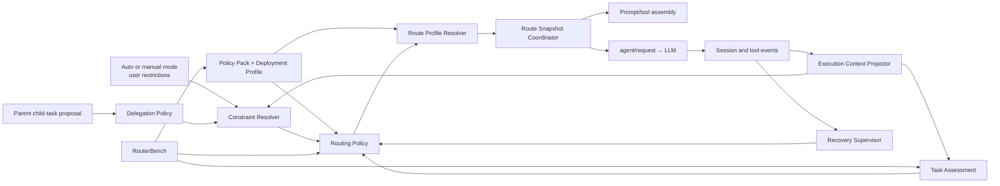

# System architecture

[简体中文](zh-CN/architecture.md)

## Status

Proposed. This document defines target capability boundaries. Verified current DSH seams and required upstream changes are recorded separately in [DSH integration evidence](dsh-integration.md).

## Architecture principles

1. Normal routing decisions belong to deterministic policy in the DSH Host, not to a parent agent, assessor, or Router Agent.
2. Task assessment, constraint resolution, policy mapping, concrete-configuration resolution, and request integration are separate layers.
3. A semantic route is a quality-guarantee tier backed by current Policy Pack evidence, not a synonym for a model name.
4. Selection, execution-state projection, recovery, and delegation are bounded control planes; they do not share an unbounded Scheduler API.
5. Persisted Session events are the source of truth. In-memory state is a projection and every automatic decision must reference the exact input snapshot that produced it.
6. One model step uses one frozen Route Snapshot across provider-dependent prompt/tool assembly and `agent/request`.
7. Failure to resolve a safe admitted configuration is a first-class stop result, not an implicit fallback.

## Components



### Execution Context Projector

Folds persisted events into the current objective, confirmed phase, task boundary, active attempts, and evidence watermarks. It is the sole owner of confirmed `ObjectiveState` and `PhaseState`. Models, parent agents, tools, and classifiers may propose a phase transition; only a deterministic transition policy or an explicitly recorded user action confirms it.

Routing Policy consumes confirmed state. A free-form claim such as “implementation is complete” cannot change phase, close an episode, or authorize down-routing by itself.

### Task Assessment

Converts a bounded execution snapshot into provider-independent attributes:

```ts
interface TaskAssessment {
  taskKind: TaskKind
  risk: 'low' | 'medium' | 'high' | 'unknown'
  scope: 'bounded' | 'broad' | 'unknown'
  verifiability: 'mechanical' | 'partial' | 'none' | 'unknown'
  reversibility: 'easy' | 'costly' | 'irreversible' | 'unknown'
  detectability: 'high' | 'medium' | 'low' | 'unknown'
  confidence: number
  assessorVersion: string
}
```

The implementation may use deterministic rules or a fixed auxiliary model. It returns attributes, never a model name. Its calibration is evaluated independently from Routing Policy.

### Constraint Resolver and Delegation Policy

Delegation Policy validates parent proposals and emits normalized candidate requirements. Constraint Resolver combines Host security and capability constraints, user restrictions, Host-accepted parent requirements, and active episode floors into `ResolvedRoutingConstraints`.

The result records accepted and rejected constraints, provenance, reason codes, the effective candidate set, and the guarantee-tier floor. Parent-provided `minimumRoute` is not automatically binding merely because it raises the tier.

### Policy Pack and Effective Route Catalog

The maintainer-owned Policy Pack contains taxonomy, absolute baseline gates, candidate admission evidence, evaluator and policy versions, expiry, and revocation. The deployment profile is populated from DSH's active provider/model catalog and exact-route metadata, then adds local capability facts and user restrictions. Reasoning is represented explicitly as an effort selected by the caller, an adapter-materialized default, or an omitted effort that preserves provider-default behavior. Compilation freezes a versioned Effective Route Catalog used by Constraint Resolver, Routing Policy, and Route Profile Resolver.

DSH discovery establishes availability, not Auto admission. The compiler intersects discovered configurations with current Policy Pack admissions, capability requirements, stable identity evidence, and user restrictions. A model may remain selectable in manual mode while being ineligible for Auto.

An arbitrary local mapping, expired record, or unidentified provider alias is not admitted automatically.

### Routing Policy

Consumes the immutable decision-input snapshot, assessment, resolved constraints, active episode floors, recovery capability, and frozen Effective Route Catalog. Given the same persisted snapshot and policy version, its semantic decision is deterministic.

Routing Policy selects a guarantee tier or abstains. It does not select a raw provider/model string and it does not decide how an unsatisfied resolution failure is presented.

### Route Profile Resolver

Resolves an admitted guarantee tier to an available provider/model/reasoning-selection candidate. It is a pure function of the frozen Effective Route Catalog and resolved constraints; it never rereads live discovery during one decision. After capability and admission filtering, it orders eligible concrete candidates by predicted end-to-end latency, then total cost, then stable route identity. Missing required identity or comparison data makes the profile invalid rather than allowing discovery order to decide. The resolver version and selected admission identity are persisted. It produces either an effective configuration or an explicit failure such as `constraints-unsatisfiable`, `profile-invalid`, `provider-unavailable`, or `no-safe-route`.

### Route Snapshot Coordinator

Owns DSH lifecycle integration for one model step:

1. At the stable pre-assembly boundary, freeze the Policy Pack and deployment profile, compile the Effective Route Catalog, and capture ordered claimed messages plus the current execution projection.
2. Persist the compiled catalog as an immutable `EffectiveRouteCatalogSnapshotEvent`.
3. Persist the raw execution state as an immutable `RoutingContextSnapshotEvent` that references that already-existing catalog snapshot.
4. Run constraint resolution and any required assessment against that context snapshot, then persist their outputs with backward references to it.
5. Persist the final `DecisionInputSnapshotEvent`, referencing only the context, constraint, and assessment events that now exist.
6. Run Routing Policy and Route Profile Resolver against that final decision input and the same frozen catalog.
7. Persist the semantic decision and resolution result.
8. Freeze and persist one `RouteSnapshot` containing the concrete identity, reasoning selection, request encoding, and relevant version references.
9. Make prompt/tool assembly and `agent/request` consume that same snapshot and snapshot identity.

If recovery selects a different route after a request failure, the coordinator starts a new step or uses an upstream seam that repeats provider-dependent assembly. It must not replace only the final request config after an earlier assembly was built for another model.

### Recovery Supervisor

Folds formal runtime signals into attempts and episodes. It supplies route floors and declared `RecoveryCapability` to Routing Policy. It uses no model by default. Full `salvage` and `restart` are separate from the minimum recovery capability required to admit mutable work.

### RouterBench

Contains two related but distinct systems:

- Route Capability Bench measures provider/model/reasoning-selection configurations and produces admission evidence without invoking production policy as the treatment assignment.
- Policy Scenario Bench runs the same policy core as production against versioned state-machine scenarios and strategy ablations.

Calibration and held-out acceptance data are separate. Benchmark oracle metadata never enters Task Assessment or online policy inputs.

## Request flow

```text
1. Session reaches a stable pre-assembly boundary
2. Execution Context Projector produces objective and confirmed phase state
3. Route Snapshot Coordinator compiles and freezes the Effective Route Catalog
4. Persist EffectiveRouteCatalogSnapshot
5. Capture and persist RoutingContextSnapshot, including ordered claimed-message references and a backward catalog reference
6. Constraint Resolver produces persisted ResolvedRoutingConstraints against that snapshot
7. Task Assessment runs when required and persists a backward reference to the same snapshot
8. Persist DecisionInputSnapshot referencing the already-existing context, constraints, and optional assessment
9. Routing Policy selects a guarantee tier or abstains
10. Route Profile Resolver deterministically resolves an admitted configuration or a stop result from the frozen catalog
11. Persist decision, resolution, evidence references, and versions
12. Freeze and persist RouteSnapshot
13. Assemble provider-dependent prompt and tools from RouteSnapshot
14. agent/request applies the same RouteSnapshot
15. DSH records request/header and calls the model
16. Runtime events flow into signal providers and Recovery Supervisor
```

An in-process child agent follows the same path. An external provider that fixes the model at process creation needs a pre-start adapter that consumes the same semantic inputs and resolver.

## Persisted event model

Names remain Proposed until the DSH event-registration seam is resolved. The minimum logical records are:

```ts
interface EffectiveRouteCatalogSnapshotEvent {
  catalogSnapshotId: CatalogSnapshotId
  policyPackVersion: string
  deploymentProfileVersion: string
  compilerVersion: string
  candidateAdmissionIds: readonly AdmissionId[]
  digest: string
}

interface RoutingContextSnapshotEvent {
  contextSnapshotId: ContextSnapshotId
  routingScope:
    | { kind: 'session'; sessionId: SessionId }
    | { kind: 'objective'; objectiveId: ObjectiveId }
  phaseId?: PhaseId
  turn: number
  step: number
  claimedMessageRefs: readonly EventRef[]
  activeEpisodeRefs: EventRef[]
  recoveryCapabilityRef: EventRef
  effectiveRouteCatalogRef: EventRef
  evidenceWatermark: number
}

interface ResolvedRoutingConstraintsEvent {
  constraintsId: ConstraintsId
  contextSnapshotRef: EventRef
  // accepted inputs, rejected inputs, provenance, candidate set, floor, reasons
}

interface TaskAssessmentEvent {
  assessmentId: AssessmentId
  contextSnapshotRef: EventRef
  assessment: TaskAssessment
}

interface DecisionInputSnapshotEvent {
  decisionInputId: DecisionInputId
  contextSnapshotRef: EventRef
  constraintsRef: EventRef
  assessmentRef?: EventRef
  policyVersion: string
  resolverVersion: string
}

interface RoutingDecisionEvent {
  decisionId: DecisionId
  decisionInputRef: EventRef
  outcome: 'selected' | 'abstained'
  route?: RouteId
  requestedFallback?: RouteId
  reasonCode: ReasonCode
  policyVersion: string
}

type RouteResolutionEvent =
  | {
      decisionId: DecisionId
      outcome: 'resolved'
      effectiveConfig: EffectiveCallConfig
      reasoningSelection: ReasoningSelection
      admissionIdentity: AdmissionIdentity
      profileVersion: string
      resolverVersion: string
    }
  | {
      decisionId: DecisionId
      outcome: 'failed'
      failureCode: ResolutionFailure
      profileVersion: string
      resolverVersion: string
    }

interface RouteSnapshotEvent {
  routeSnapshotId: RouteSnapshotId
  contextSnapshotRef: EventRef
  decisionRef: EventRef
  resolutionRef: EventRef
  turn: number
  step: number
  effectiveConfig: EffectiveCallConfig
  reasoningSelection: ReasoningSelection
  requestEncoding:
    | 'explicit-effort'
    | 'adapter-default-materialized'
    | 'provider-default-omitted'
}
```

Objective, phase, attempt, and episode events form explicit state machines with creation, transition, resolution, supersession, abandonment, restart, and user-intervention outcomes. Event references, rather than duplicated mutable fields, connect each decision to its immutable inputs.

All references point backward to already-persisted immutable events; forward references and post-persistence mutation are invalid. `claimedMessageRefs` preserve processing order, and `evidenceWatermark` defines the inclusive event boundary visible to the decision. A route snapshot identity is carried through both assembly and request integration so equality is not inferred merely from matching provider/model strings.

Every attempted decision is recorded, including a semantic keep. UI aggregation may collapse repeated keeps without deleting the underlying audit facts.

## Recovery Supervisor and model interaction

Recovery Supervisor listens to persisted Session events plus live Agent, tool, validation, and mutation events. Signal Providers normalize only sources whose semantics they own; unknown shell or external side effects become `mutation-unknown`, not inferred success.

The current model does not return supervisor JSON on every turn. One persisted, reconstructable instruction is injected only when a recovery action changes model behavior:

- `continue`: require review of inherited, unverified assumptions.
- `salvage`: render a provenance-tagged Evidence Capsule into a new execution context.
- `restart`: inject the original task and clean execution-world description without previous hypotheses.

Facts and hypotheses have separate trust classes in the Evidence Capsule.

## Optional model assessors

Task and Recovery Assessors:

- Use fixed configurations that Auto cannot recursively route.
- Make one bounded call without tools or autonomous loops.
- Consume bounded snapshots and return validated structures.
- Return `unknown` on failure, timeout, or low confidence.
- Persist outputs as evidence without decision authority.
- Have separate calibration, selection-risk, latency, and cost reports.

## DSH integration status

The current source audit confirms per-step `agent/request` configuration replacement and reconstructable `request/header` logging. It also identifies unresolved seams for required plugin Session events, pre-assembly route coordination, persistent child constraints, external-provider creation-time routing, workspace recovery, and Session handoff. The exact evidence and compatibility policy are maintained in [DSH integration evidence](dsh-integration.md).
