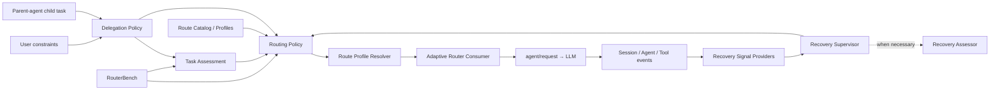

# System architecture

[简体中文](zh-CN/architecture.md)

## Status

Proposed. This document describes target capability boundaries; it does not claim that DSH already exposes every required extension point.

## Architecture principles

1. Normal routing decisions belong to a policy service in the DSH Host, not to a parent agent or Router Agent.
2. Semantic assessment, policy mapping, and concrete-model resolution are separate layers, preventing unstable model output from becoming a provider/model decision directly.
3. Selection, recovery, and delegation authority are three control planes. One product may assemble them, but they must not share an unbounded Scheduler API.
4. Runtime code executes in the Host and decides per Agent/Session; every fact required for recovery and audit belongs to the Session.
5. In-memory state is only a projection of persisted events and cannot be the sole source of truth.

## Components



### Adaptive Router Consumer

Listens to every DSH `agent/request`, gathers routing context for the current Agent, calls Routing Policy, and uses Route Profile Resolver to produce the final LLM call configuration. It owns integration, not policy.

### Task Assessment

Converts a task description and bounded context into provider-independent task attributes:

```ts
interface TaskAssessment {
  taskKind: TaskKind
  risk: 'low' | 'medium' | 'high' | 'unknown'
  scope: 'bounded' | 'broad' | 'unknown'
  verifiability: 'mechanical' | 'partial' | 'none' | 'unknown'
  reversibility: 'easy' | 'costly' | 'irreversible' | 'unknown'
  detectability: 'high' | 'medium' | 'low' | 'unknown'
  confidence: number
}
```

The implementation may use deterministic rules, a local classifier, or a fixed auxiliary model. It returns attributes, never a model name.

### Routing Policy

Consumes task attributes, hard constraints, user settings, active episodes, the Route Catalog, and RouterBench calibration data, then returns a semantic route. Given the same captured inputs and policy version, the policy mapping must be deterministic.

### Route Profile Resolver

Maps `fast`, `standard`, and `strong` to provider/model/effort combinations available in the current deployment. Public model rankings and community profiles affect profiles and cold-start priors only; they do not replace task policy directly.

### Recovery Supervisor

Folds formal runtime signals and manages attempts, episodes, and recovery actions. It uses no model by default and does not converse with the current Agent in natural language. An optional Recovery Assessor is invoked only when semantic evidence can change an expensive recovery decision.

### Delegation Policy

Normalizes child-task intent and constraints from a parent agent into routing inputs, then enforces authority rules. Parent agents may raise the quality floor or add constraints by default; they may not reduce policy requirements or select an arbitrary raw model.

### RouterBench

Uses the same Task Assessment and Routing Policy as online execution for paired route experiments, policy calibration, and regression detection. The Benchmark must not maintain a second “simplified router” that differs from production.

## Request flow

```text
1. An Agent step prepares a model request
2. Adaptive Router Consumer gathers structured context
3. Delegation Policy combines user authority, hard constraints, and parent constraints
4. Task Assessment runs when necessary
5. Routing Policy selects a semantic route or abstains
6. Route Profile Resolver resolves provider/model/effort
7. Record routing/decision
8. agent/request returns the effective call configuration
9. DSH records the effective request/header and calls the model
10. Runtime events flow into Recovery Signal Providers
11. Recovery Supervisor updates episodes or initiates a recovery action
```

Routing happens before every model request, not only when a Session or child agent is created. After creation, an in-process child agent follows the same `agent/request` path. Only providers that must fix a model before creating an external process require an additional Subagent Routing Adapter.

## Proposed persisted events

Event names and fields require review against the current DSH Session API. The minimum is:

```ts
interface RoutingDecisionEvent {
  turn: number
  step: number
  outcome: 'selected' | 'abstained'
  route: RouteId
  effectiveConfig: {
    provider: string
    model: string
    reasoningEffort?: string
  }
  reasonCode: ReasonCode
  evidenceRefs: EventRef[]
  policyVersion: string
  profileVersion: string
}

interface RecoveryEpisodeEvent {
  episodeId: string
  attemptId: string
  action: 'opened' | 'resolved' | 'superseded' | 'abandoned' | 'restarted' | 'user-cleared'
  minimumRoute: RouteId
  reasonCode: string
  evidenceRefs: EventRef[]
}
```

Record every decision, including a `keep` where the route does not change, so auto coverage, abstention, escalation, and recovery metrics are computable. `keep`, `upgrade`, and `downgrade` are display states derived from adjacent target routes, not policy outputs.

## Recovery Supervisor and Session interaction

Recovery Supervisor uses machine interfaces:

- Listen to persisted Session events and live `agent/*` and `tools/*` events.
- Use Signal Providers to normalize heterogeneous tool results into discriminated unions.
- Fold events into RecoveryState.
- Append its own log-only events.
- Provide active route floors to Routing Policy on the next `agent/request`.

It does not require the current model to return dedicated natural language or JSON on every turn. Agent todo items, plans, or `report_progress` are weak self-reports and cannot close an episode alone.

Only when a recovery action must alter model behavior does the system inject one persisted, reconstructable instruction:

- `continue`: tell the upgraded model to review unverified assumptions inherited from the previous route.
- `salvage`: render and inject a structured Evidence Capsule into a new Session.
- `restart`: inject only the original task and clean-checkpoint description, excluding previous hypotheses.

Any recovery information entering model context must travel through a DSH logged channel that can be reconstructed.

## Optional model assessors

Task Assessor and Recovery Assessor share these boundaries:

- Use a fixed configuration that Adaptive Router cannot route again.
- Make one bounded auxiliary call without tools or autonomous loops.
- Consume a bounded snapshot and return a validated data structure.
- Return `unknown` on timeout, failure, or low confidence.
- Persist output without granting it final authority.
- Include assessor latency and cost in RouterBench.

If an assessor asks a weak model whether the same weak model should be escalated, self-supervision bias results. The default assessor should be independent of the current execution model.

## DSH extension points to verify

- Whether `agent/request` lets a plugin fully replace provider/model/reasoningEffort.
- Where to read stable current turn/step, Session projection, and route capability.
- How plugins declare, restore, and render persisted events in the UI.
- Whether child-agent requests can carry persistent semantic RoutingConstraints.
- Whether an out-of-process provider can accept a semantic route before creation.
- Whether filesystem, shell, and test-runner capabilities expose enough structured validation and mutation events.
- How Session forks associate with execution-workspace checkpoints.
