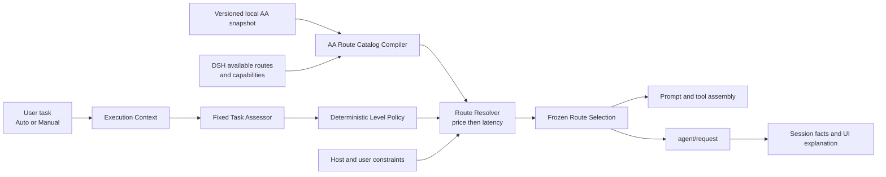

# System architecture

[简体中文](zh-CN/architecture.md)

## Status

Accepted direction under ADR-011. Verified DSH seams and fork requirements remain recorded in [DSH integration evidence](dsh-integration.md).

## Principles

1. Deterministic policy in the DSH Host owns normal route decisions.
2. Artificial Analysis supplies external capability, price, and latency data; it does not see the task or emit the final route.
3. A fixed Task Assessor emits structured task properties, never a model name.
4. User-facing handling levels are `light`, `standard`, and `deep`; they are heuristic allocation levels, not quality guarantees.
5. Executable Host route identity and AA evidence identity remain separate; explicit versioned bindings connect them without a universal variant/effort ontology.
6. Host capability and user constraints filter candidates before price comparison.
7. One model call consumes one frozen selection across provider-dependent assembly and `agent/request`.
8. Persisted Session facts, not transient UI state, are the source of truth for what Auto selected and why.

## Components



### AA Snapshot Source

Provides a versioned, local, minimized snapshot of AA records used by the catalog. The first implementation is maintained manually and Git-ignored. A later acquisition tool may refresh it outside the runtime path. Runtime routing never requires a live AA request.

The maintained seed shape is illustrated by [`examples/aa-catalog-seed.example.json`](../examples/aa-catalog-seed.example.json). Real snapshots and reviewed bindings stay under the Git-ignored `local/` directory; the repository tracks only minimized fixtures and the placeholder example. The local loader rejects files larger than 1 MiB.

### Host Route Identity Builder

Materializes each DSH route's executable identity before catalog matching:

```ts
interface HostRouteIdentity {
  routeId: string
  provider: string
  model: string
  effectiveConfigFingerprint: string
}
```

The fingerprint covers every Host-materialized request option that can change execution semantics. Reasoning effort is optional and provider-owned. Two routes with different effective configurations cannot share an identity even when their model names match.

### AA Evidence Binding Registry

Provides reviewed, versioned mappings from Host route identities to stable records in one frozen AA snapshot:

```ts
interface AAEvidenceBinding {
  bindingVersion: string
  hostRouteId: string
  effectiveConfigFingerprint: string
  aaSnapshotId: string
  aaRecordId: string
  matchBasis: readonly string[]
  limitations: readonly string[]
}
```

Bindings may cite family, version, variant, effort, date, provider, or other metadata, but no fixed subset is mandatory across providers. Runtime name similarity never creates a binding. Snapshot refresh validates binding additions, replacements, and removals explicitly rather than selecting a latest duplicate automatically.

### AA Route Catalog Compiler

Loads a maintainer-selected local seed and joins the current DSH route inventory with validated AA evidence bindings. Task 2 emits a deterministic, frozen evidence catalog before any capability boundary or price/latency field is selected:

```ts
interface AAEvidenceCatalogEntry {
  routeId: string
  provider: string
  model: string
  effectiveConfig: Readonly<Record<string, unknown>>
  effectiveConfigFingerprint: string
  aaSnapshotId: string
  aaRecordId: string
  bindingVersion: string
  evidenceBinding: AAEvidenceBinding
  aaRecord: Readonly<Record<string, unknown>>
  capabilityFacts: readonly string[]
}

interface AAEvidenceCatalogExclusion {
  source: 'host-route' | 'binding'
  hostRouteId?: string
  bindingIndex?: number
  reasonCode: string
}
```

Malformed or unmatched rows are excluded with stable reason codes. Entries and exclusions are deterministically sorted, valid-route results do not depend on Host or seed discovery order, and no network request is part of compilation. Task 3 consumes this evidence catalog, assigns each eligible route to one versioned handling level, and adds the selected AA price and latency facts used by the resolver.

The completed Phase 1 policy compiler emits frozen entries with `handlingLevel`, `aaCapabilityScore`, `aaPrice`, and nullable `aaLatencySeconds`. `aa-route-policy/v1` pins Intelligence Index methodology `v4.1.1`, Light `<35`, Standard `35–<50`, Deep `>=50`, the AA 7:2:1 blended-price field, and median time to first answer token. Missing capability or price excludes a route; missing latency sorts after measured latency within an equal-price group.

### Task Assessor

Uses a fixed model configuration outside Auto recursion. It receives a bounded description of the current task and returns task kind, scope, complexity, risk, verifiability, confidence, and concise reasons. It has no tools and cannot select a concrete model.

Timeout, failure, invalid structure, or low confidence returns an unknown assessment that maps to `deep`.

### Deterministic Level Policy

Maps Task Assessment plus Host-recognized constraints to one handling level. The same structured input and policy version always produce the same level and reason codes.

### Route Resolver

Filters the frozen catalog by:

1. selected handling level;
2. provider availability and credentials;
3. model context, modality, tool, and applicable execution-configuration support;
4. user allow/deny restrictions;
5. Host security requirements.

It then orders candidates by AA price, AA latency, and stable route identity. No token-cost estimator is involved.

If the chosen level has no candidate, it may escalate to the next level. If the catalog cannot resolve any route, a configured Host-valid deep fallback may be used with an explicit fallback reason. Otherwise resolution fails visibly.

### Route Selection Coordinator

Runs before provider-dependent assembly. It freezes:

```ts
interface FrozenRouteSelection {
  decisionId: string
  handlingLevel: 'light' | 'standard' | 'deep'
  provider: string
  model: string
  effort?: string
  effectiveConfigFingerprint: string
  aaSnapshotId?: string
  aaRecordId?: string
  evidenceBindingVersion?: string
  reasonCodes: readonly string[]
  explanation: string
  policyVersion: string
  assessorVersion: string
  catalogVersion: string
  fallback: boolean
}
```

The same provider/model/effective configuration reaches prompt assembly, `agent/request`, persisted Session facts, and the Web UI.

### Session Projection and UI

The Session records the triggering user message, frozen selection, effective request header, and resulting assistant response in causal order. The UI renders:

- handling level;
- actual model and applicable execution configuration;
- changed model/configuration animation;
- AA-informed or fallback explanation;
- snapshot and policy details on inspection.

Manual mode bypasses Auto decision logic and retains normal DSH validation.

## Request flow

```text
1. User submits a task in Auto mode.
2. Host collects the bounded task context.
3. Fixed Task Assessor returns structured attributes.
4. Deterministic policy chooses Light, Standard, or Deep.
5. Catalog compiler or cached frozen catalog exposes eligible AA-matched routes.
6. Resolver filters Host-invalid routes.
7. Resolver chooses lower AA price, then lower AA latency, then stable route ID.
8. Coordinator freezes the concrete provider/model/effective configuration and explanation.
9. Provider-dependent prompt and tools assemble from that selection.
10. agent/request applies the same selection.
11. Session persists the selection and effective request facts.
12. UI shows the level, actual route, transition, and reason.
```

## Failure flow

```text
assessor uncertain or invalid → Deep
selected level empty → escalate one level
AA catalog invalid or unmatched → configured Deep fallback
fallback unavailable or Host-invalid → explicit no-route failure
Manual selected → bypass Auto and use normal DSH path
```

Fallback never inherits an AA claim that was not matched. It is displayed as configured fallback, not as the cheapest or strongest AA route.

## Later control planes

### Adaptive execution

Runtime signals may later trigger `light → standard → deep` escalation. Reassessment requires explicit task or phase evidence. Down-routing remains a separate capability and is not implied by this architecture.

### Recovery

Recovery Supervisor remains a Host component that consumes formal events. Continue, Salvage, and Restart are implemented only under the existing recovery and effect-capability decisions.

### Delegation

Parent agents propose semantic constraints. Host policy resolves them against the same task levels and catalog; concrete provider/model bypass remains disallowed by default.

## DSH integration

The maintained fork provides the A1 pre-assembly and A2 Session-event seams used by the MVP. The next implementation reuses those seams and changes product policy, catalog matching, and UI terminology rather than adding another DSH scheduler or Router Agent.
