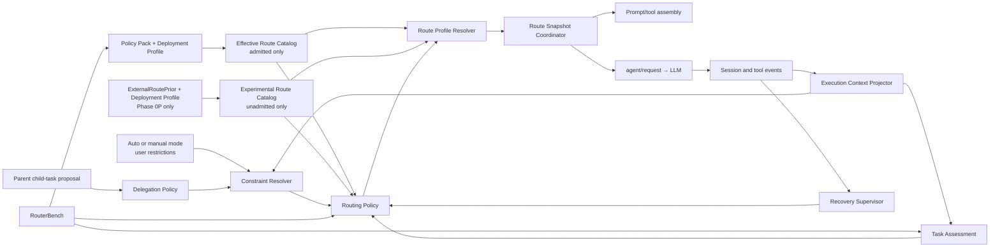

# System architecture

[简体中文](zh-CN/architecture.md)

## Status

Proposed. This document defines target capability boundaries. Verified current DSH seams and required upstream changes are recorded separately in [DSH integration evidence](dsh-integration.md).

## Architecture principles

1. Normal routing decisions belong to deterministic policy in the DSH Host, not to a parent agent, assessor, or Router Agent.
2. Task assessment, constraint resolution, policy mapping, concrete-configuration resolution, and request integration are separate layers.
3. In admitted Auto, a semantic route is a quality-guarantee tier backed by current Policy Pack evidence, not a synonym for a model name. Phase 0P reuses the identifiers only as visibly unadmitted heuristic tiers.
4. Selection, execution-state projection, recovery, and delegation are bounded control planes; they do not share an unbounded Scheduler API.
5. Persisted Session events are the source of truth. In-memory state is a projection and every automatic decision must reference the exact input snapshot that produced it.
6. One model step uses one frozen Route Snapshot across provider-dependent prompt/tool assembly and `agent/request`.
7. Failure to resolve a safe admitted configuration is a first-class stop result, not an implicit fallback.

## Components



### Execution Context Projector

Folds persisted events into the current objective, confirmed phase, task boundary, active attempts, and evidence watermarks. It is the sole owner of confirmed `ObjectiveState` and `PhaseState`. Models, parent agents, tools, and classifiers may propose a phase transition; only a deterministic transition policy or an explicitly recorded user action confirms it.

Routing Policy consumes confirmed state. A free-form claim such as “implementation is complete” cannot change phase, close an episode, or authorize down-routing by itself.

### Task Assessment

Converts a bounded execution snapshot into provider-independent attributes:

```ts
interface TaskAssessment {
  taskKind: TaskKind
  risk: 'low' | 'medium' | 'high' | 'unknown'
  scope: 'bounded' | 'broad' | 'unknown'
  verifiability: 'mechanical' | 'partial' | 'none' | 'unknown'
  reversibility: 'easy' | 'costly' | 'irreversible' | 'unknown'
  detectability: 'high' | 'medium' | 'low' | 'unknown'
  confidence: number
  assessorVersion: string
}
```

The implementation may use deterministic rules or a fixed auxiliary model. It returns attributes, never a model name. Its calibration is evaluated independently from Routing Policy.

### Constraint Resolver and Delegation Policy

Delegation Policy validates parent proposals and emits normalized candidate requirements. Constraint Resolver combines Host security and capability constraints, user restrictions, Host-accepted parent requirements, and active episode floors into `ResolvedRoutingConstraints`.

The result records accepted and rejected constraints, provenance, reason codes, the effective candidate set, and the guarantee-tier floor. Parent-provided `minimumRoute` is not automatically binding merely because it raises the tier.

### Policy Pack and Effective Route Catalog

The maintainer-owned Policy Pack contains taxonomy, absolute baseline gates, candidate admission evidence, evaluator and policy versions, expiry, and revocation. The deployment profile is populated from DSH's active provider/model catalog and exact-route metadata, then adds local capability facts and user restrictions. Reasoning is represented explicitly as an effort selected by the caller, an adapter-materialized default, or an omitted effort that preserves provider-default behavior. Compilation freezes a versioned Effective Route Catalog used by Constraint Resolver, Routing Policy, and Route Profile Resolver.

DSH discovery establishes availability, not Auto admission. The compiler intersects discovered configurations with current Policy Pack admissions, capability requirements, stable identity evidence, and user restrictions. A model may remain selectable in manual mode while being ineligible for Auto.

An arbitrary local mapping, expired record, or unidentified provider alias is not admitted automatically.

Phase 0P compiles a separate `ExperimentalRouteCatalog` from a frozen `ExternalRoutePriorSnapshot`, DSH discovery, exact A3p identity mappings, capabilities, and user restrictions. Every entry carries `evidenceStatus: 'experimental-unadmitted'`. The experimental and admitted catalog types are discriminated and cannot be merged or converted without RouterBench admission. Artificial Analysis is the first prior source, but its record supplies evidence fields only; it never owns Task Assessment or the final decision.

### Routing Policy

Consumes the immutable decision-input snapshot, assessment, resolved constraints, active episode floors, recovery capability, and the corresponding frozen admitted or experimental catalog. Given the same persisted snapshot and policy version, its semantic decision is deterministic.

Admitted Routing Policy selects a guarantee tier or abstains. Phase 0P policy selects an explicitly experimental heuristic tier or exits Auto. Neither form selects a raw provider/model string, and the external prior never owns the final decision.

### Route Profile Resolver

Resolves a semantic tier to an available provider/model/reasoning-selection candidate. In admitted Auto it filters by current admission; in Phase 0P it filters by explicit experimental evidence status and exact external-record identity. It is a pure function of the corresponding frozen catalog and resolved constraints and never rereads live discovery during one decision. It then orders eligible concrete candidates by the policy's quality boundary, predicted end-to-end latency, total cost, and stable route identity. Missing required identity or comparison data makes the profile invalid rather than allowing discovery order to decide. The resolver version and selected evidence identity are persisted. Shared structural failures include `constraints-unsatisfiable`, `profile-invalid`, `profile-unavailable`, and `provider-unavailable`. Only admitted Auto may return `no-safe-route`; Phase 0P returns `no-experimental-route` when no exactly matched experimental configuration exists. The experimental reason code makes no safety claim.

### Route Snapshot Coordinator

Owns two different lifecycle operations that must not be conflated:

**Session decision, once in Phase 0P:** At the first stable pre-assembly boundary, persist `RoutingAttemptStartedEvent`; validate the deployment profile, required Host contracts, and external prior. A failure appends `RoutingPreparationFailedEvent` with safe metadata and stops before catalog compilation. Success persists the minimized prior, Experimental Route Catalog, context, constraints, assessment, immutable decision input, one semantic decision, and one resolution. Cold load reconstructs and reuses that same Session decision; it never creates a second Phase 0P decision.

**Model-call authorization, every Experimental Auto step including the first:** Check mode first. Manual is a no-op for the Auto listener and continues through DSH's existing manual selection plus Host/provider validation; it does not create a denied authorization or reject the claimed turn. In Experimental Auto, re-read live authorization facts: required Host-contract availability, provider availability, current deployment and reasoning-selection identity against the frozen resolution, external-evidence freshness under the frozen policy, and current Host-declared `RecoveryCapability` plus effect classes. Persist a `ModelCallAuthorizationEvent` for the step. A denial stops before assembly and provider dispatch without changing or replacing the Session decision. An authorization allows the coordinator to freeze a step-specific `RouteSnapshot` that references the Session resolution and current authorization; prompt/tool assembly and `agent/request` consume that exact snapshot.

Repeated Experimental Auto steps therefore reuse policy intent but never reuse authorization. Identity, contract, evidence, provider, or capability drift fails closed. Manual mode bypasses the Auto listener. Phase 0P does not silently re-route within the Session; a new Auto decision requires a new Session or later explicitly admitted lifecycle capability.

If recovery selects a different route after a request failure, the coordinator starts a new step or uses an upstream seam that repeats provider-dependent assembly. It must not replace only the final request config after an earlier assembly was built for another model.

### Recovery Supervisor

Folds formal runtime signals into attempts and episodes. It supplies route floors and declared `RecoveryCapability` to Routing Policy. It uses no model by default. Full `salvage` and `restart` are separate from the minimum recovery capability and accepted loss bound required before policy may down-route mutable work.

### RouterBench

Contains two related but distinct systems:

- Route Capability Bench measures provider/model/reasoning-selection configurations and produces admission evidence without invoking production policy as the treatment assignment.
- Policy Scenario Bench runs the same policy core as production against versioned state-machine scenarios and strategy ablations.

Calibration and held-out acceptance data are separate. Benchmark oracle metadata never enters Task Assessment or online policy inputs.

Phase 0P dogfood traces may suggest taxonomy and fixture candidates, but they are not route-admission evidence and are excluded from held-out acceptance data unless later provenance and leakage controls establish a valid independent use.

## Request flow

```text
Session decision path — once in Phase 0P
1. Persist RoutingAttemptStarted at the first stable pre-assembly boundary
2. Validate required Host contracts, deployment profile, and minimized external prior
3a. On failure, persist RoutingPreparationFailed and stop without a catalog or call
3b. On success, persist ExternalRoutePriorSnapshot
4. Compile and persist ExperimentalRouteCatalogSnapshot with a backward prior reference
5. Persist RoutingContextSnapshot, constraints, assessment, and DecisionInputSnapshot in causal order
6. Routing Policy selects an experimental heuristic tier or stop outcome
7. Route Profile Resolver resolves against the frozen catalog
8. Persist the single Session decision and its discriminated resolution

Per-call path — every step, including the first and after cold load
9a. If Manual is active, bypass the Auto listener and continue through the existing manual Host/provider path
9b. If Experimental Auto is active, revalidate Host contracts, provider, exact deployment/reasoning identity, evidence freshness, and current RecoveryCapability/effect classes
10. Persist ModelCallAuthorization with the Session decision reference and current facts only for Experimental Auto
11a. On denial, stop before assembly and provider dispatch; do not re-decide
11b. On authorization, freeze and persist a step-specific RouteSnapshot referencing the authorization
12. Assemble provider-dependent prompt and tools from RouteSnapshot
13. agent/request applies the same RouteSnapshot
14. DSH records request/header and calls the model
15. Runtime events flow into signal providers and Recovery Supervisor
```

An in-process child agent follows the same path. An external provider that fixes the model at process creation needs a pre-start adapter that consumes the same semantic inputs and resolver.

## Persisted event model

Names remain Proposed until the DSH event-registration seam is resolved. The minimum logical records are shown below. `ExternalRoutePriorSnapshotEvent` stores only normalized records that exactly match the frozen DSH candidate inventory; it excludes unmatched upstream rows, raw API responses, credentials, request headers, user prompts, and code. `rightsPolicyVersion` identifies the locally accepted acquisition and retention rule, while attribution and content digest make the minimized evidence auditable without implying redistribution rights. Claimed inputs use the stable `MessageId` already carried by A1's immutable `UserMessage`; they are not Session `EventRef`s because `user/message` is appended only after preparation succeeds. Successful execution must later append the same message identities, while failed or interrupted preparation never duplicates raw message content into plugin events.

```ts
interface RoutingAttemptStartedEvent {
  routingAttemptId: RoutingAttemptId
  routingScope: { kind: 'session'; sessionId: SessionId }
  mode: 'admitted-auto' | 'experimental-auto'
  turn: number
  step: number
  validatorVersion: string
}

interface RoutingPreparationFailedEvent {
  preparationFailureId: PreparationFailureId
  routingAttemptRef: EventRef
  failureCode:
    | 'required-host-contract-missing'
    | 'deployment-profile-invalid'
    | 'external-prior-invalid'
    | 'external-prior-stale'
    | 'external-prior-malformed'
  safeEvidenceIdentity?: {
    source?: 'artificial-analysis'
    schemaVersion?: string
    contentDigest?: string
  }
  reasonCode: ReasonCode
  validatorVersion: string
}

interface RoutingPreparationTerminatedEvent {
  preparationTerminationId: PreparationTerminationId
  routingAttemptRef: EventRef
  cause: 'cancelled' | 'lifecycle-interrupted' | 'cold-load-orphan-recovered'
  validatorVersion: string
}

interface ExternalRoutePriorSnapshotEvent {
  kind: 'external-route-prior'
  sourceSnapshotId: ExternalEvidenceSnapshotId
  routingAttemptRef: EventRef
  schemaVersion: string
  source: 'artificial-analysis'
  endpointId: string
  querySemanticsVersion: string
  paginationComplete: true
  upstreamIndexVersion?: string
  retrievedAt: string
  attribution: { label: string; sourceUrl: string }
  rightsPolicyVersion: string
  contentDigest: string
  matchedRecords: readonly {
    externalRecordId: string
    exactConfigurationKey: string
    indexValues: Readonly<Record<string, number>>
    latencyMetrics: Readonly<Record<string, number>>
    costMetrics: Readonly<Record<string, number>>
  }[]
}

interface EffectiveRouteCatalogSnapshotEvent {
  kind: 'admitted'
  catalogSnapshotId: CatalogSnapshotId
  routingAttemptRef: EventRef
  policyPackVersion: string
  deploymentProfileVersion: string
  compilerVersion: string
  candidateAdmissionIds: readonly AdmissionId[]
  digest: string
}

interface ExperimentalRouteCatalogSnapshotEvent {
  kind: 'experimental-unadmitted'
  catalogSnapshotId: CatalogSnapshotId
  routingAttemptRef: EventRef
  externalPriorSnapshotRef: EventRef
  deploymentProfileVersion: string
  compilerVersion: string
  candidateExternalRecordIds: readonly string[]
  digest: string
}

type RouteCatalogSnapshotEvent =
  | EffectiveRouteCatalogSnapshotEvent
  | ExperimentalRouteCatalogSnapshotEvent

interface RoutingContextSnapshotEvent {
  contextSnapshotId: ContextSnapshotId
  routingAttemptRef: EventRef
  routingScope:
    | { kind: 'session'; sessionId: SessionId }
    | { kind: 'objective'; objectiveId: ObjectiveId }
  phaseId?: PhaseId
  turn: number
  step: number
  claimedMessageIds: readonly MessageId[]
  activeEpisodeRefs: EventRef[]
  recoveryCapabilityRef: EventRef
  routeCatalogSnapshotRef: EventRef
  evidenceWatermark: number
}

interface ResolvedRoutingConstraintsEvent {
  constraintsId: ConstraintsId
  contextSnapshotRef: EventRef
  // accepted inputs, rejected inputs, provenance, candidate set, floor, reasons
}

interface TaskAssessmentEvent {
  assessmentId: AssessmentId
  contextSnapshotRef: EventRef
  assessment: TaskAssessment
}

interface DecisionInputSnapshotEvent {
  decisionInputId: DecisionInputId
  contextSnapshotRef: EventRef
  constraintsRef: EventRef
  assessmentRef?: EventRef
  policyVersion: string
  resolverVersion: string
}

interface RoutingDecisionEvent {
  decisionId: DecisionId
  decisionInputRef: EventRef
  outcome: 'selected' | 'abstained'
  route?: RouteId
  requestedFallback?: RouteId
  reasonCode: ReasonCode
  policyVersion: string
}

type SharedResolutionFailure =
  | 'constraints-unsatisfiable'
  | 'profile-invalid'
  | 'profile-unavailable'
  | 'provider-unavailable'

type RouteResolutionEvent =
  | {
      decisionRef: EventRef
      outcome: 'resolved'
      evidenceKind: 'admitted'
      effectiveConfig: EffectiveCallConfig
      reasoningSelection: ReasoningSelection
      admissionIdentity: AdmissionIdentity
      profileVersion: string
      resolverVersion: string
    }
  | {
      decisionRef: EventRef
      outcome: 'resolved'
      evidenceKind: 'experimental-unadmitted'
      effectiveConfig: EffectiveCallConfig
      reasoningSelection: ReasoningSelection
      experimentalRouteIdentity: ExperimentalRouteIdentity
      sourceSnapshotId: ExternalEvidenceSnapshotId
      externalRecordId: string
      profileVersion: string
      resolverVersion: string
    }
  | {
      decisionRef: EventRef
      outcome: 'failed'
      evidenceKind: 'admitted'
      failureCode: SharedResolutionFailure | 'no-safe-route'
      profileVersion: string
      resolverVersion: string
    }
  | {
      decisionRef: EventRef
      outcome: 'failed'
      evidenceKind: 'experimental-unadmitted'
      failureCode: SharedResolutionFailure | 'no-experimental-route'
      profileVersion: string
      resolverVersion: string
    }

interface ModelCallAuthorizationFacts {
  observedMode: 'experimental-auto'
  requiredHostContractVersions: Readonly<Record<string, string>>
  observedHostContractVersions: Readonly<Record<string, string>>
  providerId: string
  providerAvailable: boolean
  expectedDeploymentIdentity: DeploymentIdentity
  observedDeploymentIdentity?: DeploymentIdentity
  sourceSnapshotId: ExternalEvidenceSnapshotId
  evidenceFreshnessCheckedAt: string
  evidenceExpiresAt: string
  recoveryCapabilityRef?: EventRef
  effectClasses: readonly EffectClass[]
  lossBoundPolicyVersion?: string
}

type ModelCallAuthorizationEvent =
  | {
      authorizationId: CallAuthorizationId
      outcome: 'authorized'
      decisionRef: EventRef
      resolutionRef: EventRef
      turn: number
      step: number
      facts: ModelCallAuthorizationFacts
      validatorVersion: string
    }
  | {
      authorizationId: CallAuthorizationId
      outcome: 'denied'
      decisionRef: EventRef
      resolutionRef: EventRef
      turn: number
      step: number
      failureCode:
        | 'required-host-contract-missing'
        | 'provider-unavailable'
        | 'deployment-identity-drifted'
        | 'external-evidence-expired'
        | 'recovery-capability-insufficient'
        | 'mutable-loss-bound-unsatisfied'
      routeOutcome: 'no-experimental-route'
      facts: ModelCallAuthorizationFacts
      reasonCode: ReasonCode
      validatorVersion: string
    }

interface RouteSnapshotEvent {
  routeSnapshotId: RouteSnapshotId
  contextSnapshotRef: EventRef
  decisionRef: EventRef
  resolutionRef: EventRef
  authorizationRef: EventRef
  turn: number
  step: number
  effectiveConfig: EffectiveCallConfig
  reasoningSelection: ReasoningSelection
  requestEncoding:
    | 'explicit-effort'
    | 'adapter-default-materialized'
    | 'provider-default-omitted'
}
```

Objective, phase, attempt, and episode events form explicit state machines with creation, transition, resolution, supersession, abandonment, restart, and user-intervention outcomes. Event references, rather than duplicated mutable fields, connect each decision to its immutable inputs.

All `EventRef` values point backward to already-persisted immutable events; forward event references and post-persistence mutation are invalid. `claimedMessageIds` are stable non-event identities supplied by A1 and preserve processing order; `evidenceWatermark` defines the inclusive event boundary visible to the decision. A route snapshot identity is carried through both assembly and request integration so equality is not inferred merely from matching provider/model strings.

Every started routing attempt records a preparation failure, a termination, or a complete decision chain. Cancellation appends a termination while the process is alive. Cold projection treats a start without a terminal event or complete decision chain as interrupted; after load and before retry, the controller appends `cold-load-orphan-recovered`. Immutable partial artifacts remain non-authoritative, and a retry may start only when no complete Session decision exists. Phase 0P records at most one complete decision per Session and one authorization outcome per attempted Experimental Auto model call. UI aggregation may collapse repeated authorized states without deleting the underlying audit facts.

## Recovery Supervisor and model interaction

Recovery Supervisor listens to persisted Session events plus live Agent, tool, validation, and mutation events. Signal Providers normalize only sources whose semantics they own; unknown shell or external side effects become `mutation-unknown`, not inferred success.

The current model does not return supervisor JSON on every turn. One persisted, reconstructable instruction is injected only when a recovery action changes model behavior:

- `continue`: require review of inherited, unverified assumptions.
- `salvage`: render a provenance-tagged Evidence Capsule into a new execution context.
- `restart`: inject the original task and clean execution-world description without previous hypotheses.

Facts and hypotheses have separate trust classes in the Evidence Capsule.

## Optional model assessors

Task and Recovery Assessors:

- Use fixed configurations that Auto cannot recursively route.
- Make one bounded call without tools or autonomous loops.
- Consume bounded snapshots and return validated structures.
- Return `unknown` on failure, timeout, or low confidence.
- Persist outputs as evidence without decision authority.
- Have separate calibration, selection-risk, latency, and cost reports.

## DSH integration status

The current source audit confirms per-step `agent/request` configuration replacement and reconstructable `request/header` logging. It also identifies unresolved seams for required plugin Session events, pre-assembly route coordination, persistent child constraints, external-provider creation-time routing, workspace recovery, and Session handoff. The exact evidence and compatibility policy are maintained in [DSH integration evidence](dsh-integration.md).
