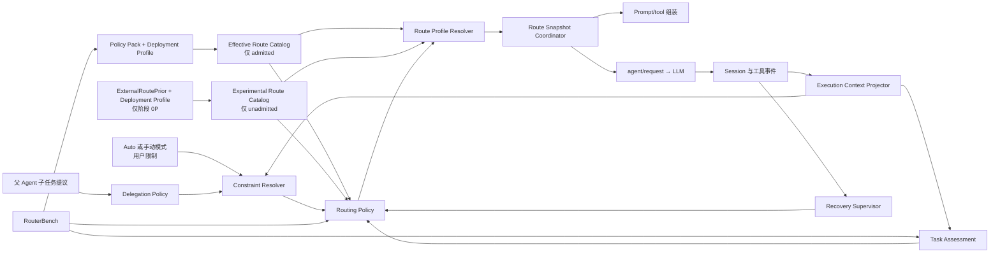

<!--
translation-source: docs/architecture.md
translation-source-blob: 56a0301689e6e4347b60ab9b70d0c7fdea934d92
translation-status: current
-->

# 系统架构

[English](../architecture.md)

## 状态

Proposed。本文件定义目标能力边界。当前已验证的 DSH seam 和所需上游修改单独记录在 [DSH 接入证据](dsh-integration.md)。

## 架构原则

1. 常规路由决策属于 DSH Host 中的确定性策略，不属于父 Agent、assessor 或 Router Agent。
2. 任务评估、约束解析、策略映射、具体配置解析和请求接入是独立层。
3. 在 admitted Auto 中，语义 route 是由当前 Policy Pack 证据支持的质量保证档，不是模型名称的同义词。阶段 0P 只把这些标识复用为明显未准入的启发式档位。
4. 选择、执行状态投影、恢复和委派是有界控制面，不共享无限制 Scheduler API。
5. 持久 Session 事件是真实来源；内存状态只是投影，每个自动决策都必须引用产生它的精确输入快照。
6. 同一个模型 step 在依赖 provider 的 prompt/tool 组装和 `agent/request` 中使用同一个冻结 Route Snapshot。
7. 无法解析安全已准入配置是一等停止结果，不是隐式 fallback。

## 组件



### Execution Context Projector

将持久事件折叠为当前 objective、已确认 phase、任务边界、active attempt 和证据 watermark。它是已确认 `ObjectiveState` 和 `PhaseState` 的唯一所有者。模型、父 Agent、工具和分类器可以提议 phase 变化；只有确定性转移策略或显式记录的用户动作能够确认。

Routing Policy 只消费已确认状态。诸如“实现已完成”的自由文本声明不能单独改变 phase、关闭 episode 或授权降级。

### Task Assessment

将有界执行快照转换为与 provider 无关的属性：

```ts
interface TaskAssessment {
  taskKind: TaskKind
  risk: 'low' | 'medium' | 'high' | 'unknown'
  scope: 'bounded' | 'broad' | 'unknown'
  verifiability: 'mechanical' | 'partial' | 'none' | 'unknown'
  reversibility: 'easy' | 'costly' | 'irreversible' | 'unknown'
  detectability: 'high' | 'medium' | 'low' | 'unknown'
  confidence: number
  assessorVersion: string
}
```

实现可以使用确定性规则或固定辅助模型。它返回属性，绝不返回模型名。其校准与 Routing Policy 分开评估。

### Constraint Resolver 与 Delegation Policy

Delegation Policy 验证父 Agent 提议并输出规范化候选要求。Constraint Resolver 将 Host 安全和能力约束、用户限制、Host 接受的父 Agent 要求及 active episode floor 合并为 `ResolvedRoutingConstraints`。

结果记录接受和拒绝的约束、来源、reason code、生效候选集和保证档 floor。父 Agent 提供的 `minimumRoute` 不会仅因它提高档位就自动成为硬约束。

### Policy Pack 与 Effective Route Catalog

维护者负责的 Policy Pack 包含 taxonomy、baseline 绝对门槛、candidate 准入证据、evaluator/policy 版本、过期和撤销。部署 Profile 从 DSH active provider/model catalog 和精确 route 元数据填充，再加入本地能力事实与用户限制。Reasoning 显式表示为调用方指定的 effort、adapter 实体化的默认值，或保留 provider-default 行为的 effort 省略。编译过程冻结一份带版本的 Effective Route Catalog，供 Constraint Resolver、Routing Policy 与 Route Profile Resolver 共同使用。

DSH discovery 只能证明可用性，不能授予 Auto 准入。Compiler 对已发现配置、当前 Policy Pack 准入、capability 要求、稳定 identity 证据和用户限制取交集。一个模型可以继续在手动模式中可选，同时没有资格被 Auto 选择。

任意本地映射、过期记录或无法识别的 provider alias 都不会自动准入。

阶段 0P 从冻结的 `ExternalRoutePriorSnapshot`、DSH discovery、精确 A3p identity 映射、capability 与用户限制编译独立 `ExperimentalRouteCatalog`。每个条目携带 `evidenceStatus: 'experimental-unadmitted'`。实验 catalog 与 admitted catalog 使用可判别类型，未经 RouterBench admission 不得合并或转换。Artificial Analysis 是第一个 prior 来源，但其记录只提供证据字段；它不拥有 Task Assessment 或最终决策权。

### Routing Policy

消费不可变决策输入快照、assessment、已解析约束、active episode floor、恢复能力，以及与当前模式对应的冻结 admitted 或 experimental catalog。在持久快照和 policy 版本相同时，语义决策必须确定。

Admitted Routing Policy 选择保证档或 abstain。阶段 0P policy 选择明确实验性的启发式档位，或者退出 Auto。两者都不直接选择原始 provider/model 字符串，外部 prior 也不拥有最终决策权。

### Route Profile Resolver

把语义档位解析为可用 provider/model/reasoning-selection candidate。在 admitted Auto 中按当前 admission 过滤；在阶段 0P 中按明确实验 evidence status 和精确外部记录 identity 过滤。它是相应冻结 catalog 与已解析约束的纯函数，一次决策中绝不重新读取 live discovery。之后按策略质量边界、预测端到端延迟、总成本和稳定 route identity 排序具体候选。缺少必需 identity 或比较数据时判定 `profile-invalid`，不能让 discovery 顺序决定结果。Resolver 版本和选中的 evidence identity 都要持久化。两种模式共用的结构性失败包括 `constraints-unsatisfiable`、`profile-invalid`、`profile-unavailable` 与 `provider-unavailable`。只有 admitted Auto 可以返回 `no-safe-route`；阶段 0P 在没有精确匹配的实验配置时返回 `no-experimental-route`。实验 reason code 不作任何安全主张。

### Route Snapshot Coordinator

拥有两项不能混淆的生命周期操作：

**Session decision，阶段 0P 只执行一次：** 在第一个稳定 pre-assembly 边界持久化 `RoutingAttemptStartedEvent`，再校验 deployment profile、必需 Host contract 与 external prior。失败时追加只含安全元数据的 `RoutingPreparationFailedEvent`，并在 catalog 编译前停止。成功时依次持久化最小化 prior、Experimental Route Catalog、context、constraints、assessment、不可变 decision input、一项语义 decision 和一项 resolution。冷加载重建并复用同一个 Session decision；绝不创建第二个阶段 0P decision。

**Model-call authorization，包括首次在内的每个 Experimental Auto step 都执行：** 先检查 mode。手动模式对 Auto listener 是 no-op，继续走 DSH 现有手动选择与 Host/provider validation；不会创建 denied authorization，也不会 reject 已领取 turn。Experimental Auto 中只重新读取 live authorization facts：必需 Host contract 是否可用、provider availability、当前 deployment/reasoning-selection identity 是否仍匹配冻结 resolution、冻结 policy 下的 external-evidence freshness，以及当前 Host 声明的 `RecoveryCapability` 与 effect class。为该 step 持久化 `ModelCallAuthorizationEvent`。拒绝时在 assembly/provider dispatch 前停止，不改变或替换 Session decision。授权时冻结 step-specific `RouteSnapshot`，引用 Session resolution 与当前 authorization；prompt/tool assembly 与 `agent/request` 使用该精确 snapshot。

因此 repeated Experimental Auto step 复用 policy intent，但绝不复用 authorization。Identity、contract、evidence、provider 或 capability 漂移都 fail closed。手动模式绕过 Auto listener。阶段 0P 不会在 Session 内静默重新路由；新的 Auto decision 需要新 Session，或后续明确准入的生命周期能力。

若请求失败后恢复策略选择不同 route，Coordinator 必须开始新 step，或使用能重新执行 provider 相关组装的上游 seam。不能只替换最终请求配置，却保留为另一个模型组装的上下文。

### Recovery Supervisor

将正式运行信号折叠为 attempt 和 episode，并向 Routing Policy 提供 route floor 和已声明 `RecoveryCapability`。默认不使用模型。完整 `salvage/restart` 与 policy 对可变工作降档前所需的最低恢复能力及已接受 loss bound 相互独立。

### RouterBench

包含两个相关但独立的系统：

- Route Capability Bench 在不让生产策略分配 treatment 的情况下测量 provider/model/reasoning-selection 配置并产生准入证据。
- Policy Scenario Bench 在版本化状态机场景和策略消融上运行与生产相同的 policy core。

calibration 数据和 held-out 验收数据分离。Benchmark oracle 元数据绝不进入 Task Assessment 或在线策略输入。

阶段 0P dogfood trace 可以提示 taxonomy 和 fixture 候选，但不是 route-admission evidence；除非后续 provenance 与防泄漏控制证明可以独立使用，否则不得进入 held-out acceptance 数据。

## 请求流程

```text
Session decision path — 阶段 0P 只执行一次
1. 在第一个稳定 pre-assembly 边界持久化 RoutingAttemptStarted
2. 校验必需 Host contract、deployment profile 与最小化 external prior
3a. 失败时持久化 RoutingPreparationFailed；不产生 catalog 或调用
3b. 成功时持久化 ExternalRoutePriorSnapshot
4. 编译并持久化 ExperimentalRouteCatalogSnapshot，向后引用 prior
5. 按因果顺序持久化 RoutingContextSnapshot、constraints、assessment 与 DecisionInputSnapshot
6. Routing Policy 选择 experimental 启发式档或停止结果
7. Route Profile Resolver 针对冻结 catalog 解析
8. 持久化唯一 Session decision 及其可判别 resolution

Per-call path — 包括首次与 cold load 后在内的每个 step
9a. 手动模式 active 时绕过 Auto listener，继续现有手动 Host/provider 路径
9b. Experimental Auto active 时重新校验 Host contract、provider、精确 deployment/reasoning identity、evidence freshness 与当前 RecoveryCapability/effect class
10. 仅对 Experimental Auto 持久化 ModelCallAuthorization，引用 Session decision 与当前 facts
11a. 拒绝时在 assembly/provider dispatch 前停止；不重新决策
11b. 授权时冻结并持久化 step-specific RouteSnapshot，引用该 authorization
12. 按 RouteSnapshot 组装依赖 provider 的 prompt 与工具
13. agent/request 应用同一 RouteSnapshot
14. DSH 记录 request/header 并调用模型
15. 运行事件进入 Signal Provider 与 Recovery Supervisor
```

进程内子 Agent 走同一路径。必须在进程创建时固定模型的外部 provider，需要消费同一语义输入和 Resolver 的 pre-start adapter。

## 持久事件模型

在 DSH 事件注册 seam 解决前，事件名保持 Proposed。最低逻辑记录如下。`ExternalRoutePriorSnapshotEvent` 只保存与冻结 DSH candidate 清单精确匹配的规范化记录；排除未匹配上游行、原始 API response、credential、request header、用户 prompt 与代码。`rightsPolicyVersion` 标识本地已接受的数据获取/保留规则；attribution 与 content digest 让最小化证据可审计，但不暗示拥有再分发权。Claimed input 使用 A1 不可变 `UserMessage` 已携带的稳定 `MessageId`；它们不是 Session `EventRef`，因为 `user/message` 只有在 preparation 成功后才追加。成功执行必须随后追加同一 message identity；失败或中断 preparation 绝不把原始 message 内容复制进 plugin event。

```ts
interface RoutingAttemptStartedEvent {
  routingAttemptId: RoutingAttemptId
  routingScope: { kind: 'session'; sessionId: SessionId }
  mode: 'admitted-auto' | 'experimental-auto'
  turn: number
  step: number
  validatorVersion: string
}

interface RoutingPreparationFailedEvent {
  preparationFailureId: PreparationFailureId
  routingAttemptRef: EventRef
  failureCode:
    | 'required-host-contract-missing'
    | 'deployment-profile-invalid'
    | 'external-prior-invalid'
    | 'external-prior-stale'
    | 'external-prior-malformed'
  safeEvidenceIdentity?: {
    source?: 'artificial-analysis'
    schemaVersion?: string
    contentDigest?: string
  }
  reasonCode: ReasonCode
  validatorVersion: string
}

interface RoutingPreparationTerminatedEvent {
  preparationTerminationId: PreparationTerminationId
  routingAttemptRef: EventRef
  cause: 'cancelled' | 'lifecycle-interrupted' | 'cold-load-orphan-recovered'
  validatorVersion: string
}

interface ExternalRoutePriorSnapshotEvent {
  kind: 'external-route-prior'
  sourceSnapshotId: ExternalEvidenceSnapshotId
  routingAttemptRef: EventRef
  schemaVersion: string
  source: 'artificial-analysis'
  endpointId: string
  querySemanticsVersion: string
  paginationComplete: true
  upstreamIndexVersion?: string
  retrievedAt: string
  attribution: { label: string; sourceUrl: string }
  rightsPolicyVersion: string
  contentDigest: string
  matchedRecords: readonly {
    externalRecordId: string
    exactConfigurationKey: string
    indexValues: Readonly<Record<string, number>>
    latencyMetrics: Readonly<Record<string, number>>
    costMetrics: Readonly<Record<string, number>>
  }[]
}

interface EffectiveRouteCatalogSnapshotEvent {
  kind: 'admitted'
  catalogSnapshotId: CatalogSnapshotId
  routingAttemptRef: EventRef
  policyPackVersion: string
  deploymentProfileVersion: string
  compilerVersion: string
  candidateAdmissionIds: readonly AdmissionId[]
  digest: string
}

interface ExperimentalRouteCatalogSnapshotEvent {
  kind: 'experimental-unadmitted'
  catalogSnapshotId: CatalogSnapshotId
  routingAttemptRef: EventRef
  externalPriorSnapshotRef: EventRef
  deploymentProfileVersion: string
  compilerVersion: string
  candidateExternalRecordIds: readonly string[]
  digest: string
}

type RouteCatalogSnapshotEvent =
  | EffectiveRouteCatalogSnapshotEvent
  | ExperimentalRouteCatalogSnapshotEvent

interface RoutingContextSnapshotEvent {
  contextSnapshotId: ContextSnapshotId
  routingAttemptRef: EventRef
  routingScope:
    | { kind: 'session'; sessionId: SessionId }
    | { kind: 'objective'; objectiveId: ObjectiveId }
  phaseId?: PhaseId
  turn: number
  step: number
  claimedMessageIds: readonly MessageId[]
  activeEpisodeRefs: EventRef[]
  recoveryCapabilityRef: EventRef
  routeCatalogSnapshotRef: EventRef
  evidenceWatermark: number
}

interface ResolvedRoutingConstraintsEvent {
  constraintsId: ConstraintsId
  contextSnapshotRef: EventRef
  // accepted inputs、rejected inputs、provenance、candidate set、floor、reasons
}

interface TaskAssessmentEvent {
  assessmentId: AssessmentId
  contextSnapshotRef: EventRef
  assessment: TaskAssessment
}

interface DecisionInputSnapshotEvent {
  decisionInputId: DecisionInputId
  contextSnapshotRef: EventRef
  constraintsRef: EventRef
  assessmentRef?: EventRef
  policyVersion: string
  resolverVersion: string
}

interface RoutingDecisionEvent {
  decisionId: DecisionId
  decisionInputRef: EventRef
  outcome: 'selected' | 'abstained'
  route?: RouteId
  requestedFallback?: RouteId
  reasonCode: ReasonCode
  policyVersion: string
}

type SharedResolutionFailure =
  | 'constraints-unsatisfiable'
  | 'profile-invalid'
  | 'profile-unavailable'
  | 'provider-unavailable'

type RouteResolutionEvent =
  | {
      decisionRef: EventRef
      outcome: 'resolved'
      evidenceKind: 'admitted'
      effectiveConfig: EffectiveCallConfig
      reasoningSelection: ReasoningSelection
      admissionIdentity: AdmissionIdentity
      profileVersion: string
      resolverVersion: string
    }
  | {
      decisionRef: EventRef
      outcome: 'resolved'
      evidenceKind: 'experimental-unadmitted'
      effectiveConfig: EffectiveCallConfig
      reasoningSelection: ReasoningSelection
      experimentalRouteIdentity: ExperimentalRouteIdentity
      sourceSnapshotId: ExternalEvidenceSnapshotId
      externalRecordId: string
      profileVersion: string
      resolverVersion: string
    }
  | {
      decisionRef: EventRef
      outcome: 'failed'
      evidenceKind: 'admitted'
      failureCode: SharedResolutionFailure | 'no-safe-route'
      profileVersion: string
      resolverVersion: string
    }
  | {
      decisionRef: EventRef
      outcome: 'failed'
      evidenceKind: 'experimental-unadmitted'
      failureCode: SharedResolutionFailure | 'no-experimental-route'
      profileVersion: string
      resolverVersion: string
    }

interface ModelCallAuthorizationFacts {
  observedMode: 'experimental-auto'
  requiredHostContractVersions: Readonly<Record<string, string>>
  observedHostContractVersions: Readonly<Record<string, string>>
  providerId: string
  providerAvailable: boolean
  expectedDeploymentIdentity: DeploymentIdentity
  observedDeploymentIdentity?: DeploymentIdentity
  sourceSnapshotId: ExternalEvidenceSnapshotId
  evidenceFreshnessCheckedAt: string
  evidenceExpiresAt: string
  recoveryCapabilityRef?: EventRef
  effectClasses: readonly EffectClass[]
  lossBoundPolicyVersion?: string
}

type ModelCallAuthorizationEvent =
  | {
      authorizationId: CallAuthorizationId
      outcome: 'authorized'
      decisionRef: EventRef
      resolutionRef: EventRef
      turn: number
      step: number
      facts: ModelCallAuthorizationFacts
      validatorVersion: string
    }
  | {
      authorizationId: CallAuthorizationId
      outcome: 'denied'
      decisionRef: EventRef
      resolutionRef: EventRef
      turn: number
      step: number
      failureCode:
        | 'required-host-contract-missing'
        | 'provider-unavailable'
        | 'deployment-identity-drifted'
        | 'external-evidence-expired'
        | 'recovery-capability-insufficient'
        | 'mutable-loss-bound-unsatisfied'
      routeOutcome: 'no-experimental-route'
      facts: ModelCallAuthorizationFacts
      reasonCode: ReasonCode
      validatorVersion: string
    }

interface RouteSnapshotEvent {
  routeSnapshotId: RouteSnapshotId
  contextSnapshotRef: EventRef
  decisionRef: EventRef
  resolutionRef: EventRef
  authorizationRef: EventRef
  turn: number
  step: number
  effectiveConfig: EffectiveCallConfig
  reasoningSelection: ReasoningSelection
  requestEncoding:
    | 'explicit-effort'
    | 'adapter-default-materialized'
    | 'provider-default-omitted'
}
```

Objective、phase、attempt 和 episode 事件构成显式状态机，包含创建、转移、解决、取代、放弃、重启和用户干预结果。事件引用将每次决策连接到不可变输入，避免复制可变字段。

所有 `EventRef` 都必须指向已经持久化的不可变事件；禁止 forward event reference 和持久化后的 mutation。`claimedMessageIds` 是 A1 提供的稳定非事件 identity，并保留处理顺序；`evidenceWatermark` 定义本次决策可见的包含式事件边界。Route snapshot identity 必须贯穿组装与 request 接入，不能只因 provider/model 字符串相同就推断它们使用了同一快照。

每个已启动 routing attempt 都记录 preparation failure、termination 或完整 decision chain。进程存活时 cancellation 追加 termination。Cold projection 把没有 terminal event 或完整 decision chain 的 start 视为 interrupted；load 完成后、retry 前，由 controller 追加 `cold-load-orphan-recovered`。不可变 partial artifact 保持 non-authoritative；只有不存在完整 Session decision 时才可开始 retry。阶段 0P 每个 Session 最多记录一项完整 decision，并为每次 attempted Experimental Auto model call 记录一项 authorization outcome。UI 可以聚合连续 authorized 状态，但不能删除底层审计事实。

## Recovery Supervisor 与模型交互

Recovery Supervisor 监听持久 Session 事件及 live Agent、工具、验证和 mutation 事件。Signal Provider 只规范化自身拥有语义的来源；未知 shell 或外部副作用标为 `mutation-unknown`，不能推断成功。

当前模型无需在每个 turn 返回 supervisor JSON。只有恢复动作改变模型行为时，才注入一次可持久重建的指令：

- `continue`：要求检查继承的未验证假设。
- `salvage`：将带 provenance 的 Evidence Capsule 渲染到新执行上下文。
- `restart`：注入原始任务和干净执行世界描述，不带之前假设。

Evidence Capsule 中的事实与假设使用不同 trust class。

## 可选模型 Assessor

Task Assessor 与 Recovery Assessor：

- 使用 Auto 不能递归路由的固定配置。
- 只进行一次有界调用，不使用工具或自主循环。
- 消费有界快照并返回通过校验的结构。
- 失败、超时或低置信度时返回 `unknown`。
- 将输出作为证据持久化，但不给予决策权。
- 分别报告校准、选择性风险、延迟和成本。

## DSH 接入状态

当前源码审计确认了逐 step `agent/request` 配置替换和可重建 `request/header` 日志，同时识别出 required 插件 Session 事件、组装前 route 协调、持久子 Agent 约束、外部 provider 创建时路由、工作区恢复和 Session handoff 等未解决 seam。准确证据和兼容策略在 [DSH 接入证据](dsh-integration.md)维护。
