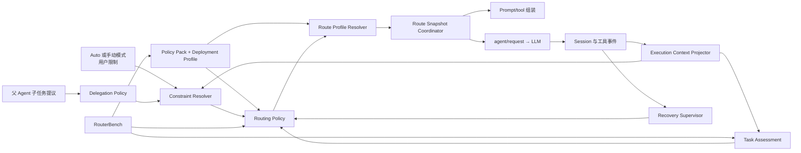

<!--
translation-source: docs/architecture.md
translation-source-blob: a18ae10431bb66f92e7f05d443aee5be6ec1f4c9
translation-status: current
-->

# 系统架构

[English](../architecture.md)

## 状态

Proposed。本文件定义目标能力边界。当前已验证的 DSH seam 和所需上游修改单独记录在 [DSH 接入证据](dsh-integration.md)。

## 架构原则

1. 常规路由决策属于 DSH Host 中的确定性策略，不属于父 Agent、assessor 或 Router Agent。
2. 任务评估、约束解析、策略映射、具体配置解析和请求接入是独立层。
3. 语义 route 是由当前 Policy Pack 证据支持的质量保证档，不是模型名称的同义词。
4. 选择、执行状态投影、恢复和委派是有界控制面，不共享无限制 Scheduler API。
5. 持久 Session 事件是真实来源；内存状态只是投影，每个自动决策都必须引用产生它的精确输入快照。
6. 同一个模型 step 在依赖 provider 的 prompt/tool 组装和 `agent/request` 中使用同一个冻结 Route Snapshot。
7. 无法解析安全已准入配置是一等停止结果，不是隐式 fallback。

## 组件



### Execution Context Projector

将持久事件折叠为当前 objective、已确认 phase、任务边界、active attempt 和证据 watermark。它是已确认 `ObjectiveState` 和 `PhaseState` 的唯一所有者。模型、父 Agent、工具和分类器可以提议 phase 变化；只有确定性转移策略或显式记录的用户动作能够确认。

Routing Policy 只消费已确认状态。诸如“实现已完成”的自由文本声明不能单独改变 phase、关闭 episode 或授权降级。

### Task Assessment

将有界执行快照转换为与 provider 无关的属性：

```ts
interface TaskAssessment {
  taskKind: TaskKind
  risk: 'low' | 'medium' | 'high' | 'unknown'
  scope: 'bounded' | 'broad' | 'unknown'
  verifiability: 'mechanical' | 'partial' | 'none' | 'unknown'
  reversibility: 'easy' | 'costly' | 'irreversible' | 'unknown'
  detectability: 'high' | 'medium' | 'low' | 'unknown'
  confidence: number
  assessorVersion: string
}
```

实现可以使用确定性规则或固定辅助模型。它返回属性，绝不返回模型名。其校准与 Routing Policy 分开评估。

### Constraint Resolver 与 Delegation Policy

Delegation Policy 验证父 Agent 提议并输出规范化候选要求。Constraint Resolver 将 Host 安全和能力约束、用户限制、Host 接受的父 Agent 要求及 active episode floor 合并为 `ResolvedRoutingConstraints`。

结果记录接受和拒绝的约束、来源、reason code、生效候选集和保证档 floor。父 Agent 提供的 `minimumRoute` 不会仅因它提高档位就自动成为硬约束。

### Policy Pack 与 Effective Route Catalog

维护者负责的 Policy Pack 包含 taxonomy、baseline 绝对门槛、candidate 准入证据、evaluator/policy 版本、过期和撤销。部署 Profile 从 DSH active provider/model catalog 和精确 route 元数据填充，再加入本地能力事实与用户限制。Reasoning 显式表示为调用方指定的 effort、adapter 实体化的默认值，或保留 provider-default 行为的 effort 省略。编译过程冻结一份带版本的 Effective Route Catalog，供 Constraint Resolver、Routing Policy 与 Route Profile Resolver 共同使用。

DSH discovery 只能证明可用性，不能授予 Auto 准入。Compiler 对已发现配置、当前 Policy Pack 准入、capability 要求、稳定 identity 证据和用户限制取交集。一个模型可以继续在手动模式中可选，同时没有资格被 Auto 选择。

任意本地映射、过期记录或无法识别的 provider alias 都不会自动准入。

### Routing Policy

消费不可变决策输入快照、assessment、已解析约束、active episode floor、恢复能力和冻结的 Effective Route Catalog。在持久快照和 policy 版本相同时，语义决策必须确定。

Routing Policy 选择保证档或 abstain。它不选择原始 provider/model 字符串，也不决定如何展示无法满足的解析失败。

### Route Profile Resolver

将已准入保证档解析为可用 provider/model/reasoning-selection candidate。它是冻结 Effective Route Catalog 与已解析约束的纯函数；一次决策中绝不重新读取 live discovery。完成 capability 与 admission 过滤后，它按预测端到端延迟、总成本和稳定 route identity 依次排序具体候选。缺少必需 identity 或比较数据时判定 `profile-invalid`，不能让 discovery 顺序决定结果。Resolver 版本和选中的 admission identity 都要持久化。输出是生效配置，或 `constraints-unsatisfiable`、`profile-invalid`、`provider-unavailable`、`no-safe-route` 等明确失败。

### Route Snapshot Coordinator

拥有一个模型 step 的 DSH 生命周期接入：

1. 在稳定的 pre-assembly 边界冻结 Policy Pack 与 deployment profile，编译 Effective Route Catalog，并捕获按序排列的 claimed message 和当前执行投影。
2. 把编译后的 catalog 持久化为不可变 `EffectiveRouteCatalogSnapshotEvent`。
3. 把原始执行状态持久化为不可变 `RoutingContextSnapshotEvent`，并引用已经存在的 catalog snapshot。
4. 针对该 context snapshot 运行约束解析和必要 assessment，再将输出以向后引用的形式持久化。
5. 持久化最终 `DecisionInputSnapshotEvent`，只引用此时已经存在的 context、constraint 和 assessment 事件。
6. 让 Routing Policy 与 Route Profile Resolver 针对最终决策输入和同一冻结 catalog 运行。
7. 持久化语义决策与解析结果。
8. 冻结并持久化一份 `RouteSnapshot`，包含具体 identity、reasoning selection、request encoding 和相关版本引用。
9. 让 prompt/tool 组装和 `agent/request` 消费同一快照及其 snapshot identity。

若请求失败后恢复策略选择不同 route，Coordinator 必须开始新 step，或使用能重新执行 provider 相关组装的上游 seam。不能只替换最终请求配置，却保留为另一个模型组装的上下文。

### Recovery Supervisor

将正式运行信号折叠为 attempt 和 episode，并向 Routing Policy 提供 route floor 和已声明 `RecoveryCapability`。默认不使用模型。完整 `salvage/restart` 与可变工作准入所需的最低恢复能力相互独立。

### RouterBench

包含两个相关但独立的系统：

- Route Capability Bench 在不让生产策略分配 treatment 的情况下测量 provider/model/reasoning-selection 配置并产生准入证据。
- Policy Scenario Bench 在版本化状态机场景和策略消融上运行与生产相同的 policy core。

calibration 数据和 held-out 验收数据分离。Benchmark oracle 元数据绝不进入 Task Assessment 或在线策略输入。

## 请求流程

```text
1. Session 到达稳定的组装前边界
2. Execution Context Projector 产生 objective 和已确认 phase 状态
3. Route Snapshot Coordinator 编译并冻结 Effective Route Catalog
4. 持久化 EffectiveRouteCatalogSnapshot
5. 捕获并持久化 RoutingContextSnapshot，包括 ordered claimed-message reference 和向后的 catalog 引用
6. Constraint Resolver 针对该快照产生持久化 ResolvedRoutingConstraints
7. 必要时运行 Task Assessment，并持久化对同一快照的向后引用
8. 持久化 DecisionInputSnapshot，引用已经存在的 context、constraints 和可选 assessment
9. Routing Policy 选择保证档或 abstain
10. Route Profile Resolver 从冻结 catalog 确定性地解析已准入配置或停止结果
11. 持久化决策、解析、证据引用和版本
12. 冻结并持久化 RouteSnapshot
13. 按 RouteSnapshot 组装依赖 provider 的 prompt 和工具
14. agent/request 应用同一 RouteSnapshot
15. DSH 记录 request/header 并调用模型
16. 运行事件进入 Signal Provider 与 Recovery Supervisor
```

进程内子 Agent 走同一路径。必须在进程创建时固定模型的外部 provider，需要消费同一语义输入和 Resolver 的 pre-start adapter。

## 持久事件模型

在 DSH 事件注册 seam 解决前，事件名保持 Proposed。最低逻辑记录为：

```ts
interface EffectiveRouteCatalogSnapshotEvent {
  catalogSnapshotId: CatalogSnapshotId
  policyPackVersion: string
  deploymentProfileVersion: string
  compilerVersion: string
  candidateAdmissionIds: readonly AdmissionId[]
  digest: string
}

interface RoutingContextSnapshotEvent {
  contextSnapshotId: ContextSnapshotId
  routingScope:
    | { kind: 'session'; sessionId: SessionId }
    | { kind: 'objective'; objectiveId: ObjectiveId }
  phaseId?: PhaseId
  turn: number
  step: number
  claimedMessageRefs: readonly EventRef[]
  activeEpisodeRefs: EventRef[]
  recoveryCapabilityRef: EventRef
  effectiveRouteCatalogRef: EventRef
  evidenceWatermark: number
}

interface ResolvedRoutingConstraintsEvent {
  constraintsId: ConstraintsId
  contextSnapshotRef: EventRef
  // accepted inputs、rejected inputs、provenance、candidate set、floor、reasons
}

interface TaskAssessmentEvent {
  assessmentId: AssessmentId
  contextSnapshotRef: EventRef
  assessment: TaskAssessment
}

interface DecisionInputSnapshotEvent {
  decisionInputId: DecisionInputId
  contextSnapshotRef: EventRef
  constraintsRef: EventRef
  assessmentRef?: EventRef
  policyVersion: string
  resolverVersion: string
}

interface RoutingDecisionEvent {
  decisionId: DecisionId
  decisionInputRef: EventRef
  outcome: 'selected' | 'abstained'
  route?: RouteId
  requestedFallback?: RouteId
  reasonCode: ReasonCode
  policyVersion: string
}

type RouteResolutionEvent =
  | {
      decisionId: DecisionId
      outcome: 'resolved'
      effectiveConfig: EffectiveCallConfig
      reasoningSelection: ReasoningSelection
      admissionIdentity: AdmissionIdentity
      profileVersion: string
      resolverVersion: string
    }
  | {
      decisionId: DecisionId
      outcome: 'failed'
      failureCode: ResolutionFailure
      profileVersion: string
      resolverVersion: string
    }

interface RouteSnapshotEvent {
  routeSnapshotId: RouteSnapshotId
  contextSnapshotRef: EventRef
  decisionRef: EventRef
  resolutionRef: EventRef
  turn: number
  step: number
  effectiveConfig: EffectiveCallConfig
  reasoningSelection: ReasoningSelection
  requestEncoding:
    | 'explicit-effort'
    | 'adapter-default-materialized'
    | 'provider-default-omitted'
}
```

Objective、phase、attempt 和 episode 事件构成显式状态机，包含创建、转移、解决、取代、放弃、重启和用户干预结果。事件引用将每次决策连接到不可变输入，避免复制可变字段。

所有引用都必须指向已经持久化的不可变事件；禁止 forward reference 和持久化后的 mutation。`claimedMessageRefs` 保留处理顺序，`evidenceWatermark` 定义本次决策可见的包含式事件边界。Route snapshot identity 必须贯穿组装与 request 接入，不能只因 provider/model 字符串相同就推断它们使用了同一快照。

每次尝试的决策都要记录，包括语义 keep。UI 可以聚合连续 keep，但不能删除底层审计事实。

## Recovery Supervisor 与模型交互

Recovery Supervisor 监听持久 Session 事件及 live Agent、工具、验证和 mutation 事件。Signal Provider 只规范化自身拥有语义的来源；未知 shell 或外部副作用标为 `mutation-unknown`，不能推断成功。

当前模型无需在每个 turn 返回 supervisor JSON。只有恢复动作改变模型行为时，才注入一次可持久重建的指令：

- `continue`：要求检查继承的未验证假设。
- `salvage`：将带 provenance 的 Evidence Capsule 渲染到新执行上下文。
- `restart`：注入原始任务和干净执行世界描述，不带之前假设。

Evidence Capsule 中的事实与假设使用不同 trust class。

## 可选模型 Assessor

Task Assessor 与 Recovery Assessor：

- 使用 Auto 不能递归路由的固定配置。
- 只进行一次有界调用，不使用工具或自主循环。
- 消费有界快照并返回通过校验的结构。
- 失败、超时或低置信度时返回 `unknown`。
- 将输出作为证据持久化，但不给予决策权。
- 分别报告校准、选择性风险、延迟和成本。

## DSH 接入状态

当前源码审计确认了逐 step `agent/request` 配置替换和可重建 `request/header` 日志，同时识别出 required 插件 Session 事件、组装前 route 协调、持久子 Agent 约束、外部 provider 创建时路由、工作区恢复和 Session handoff 等未解决 seam。准确证据和兼容策略在 [DSH 接入证据](dsh-integration.md)维护。
