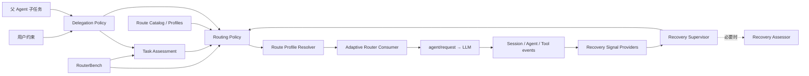

<!--
translation-source: docs/architecture.md
translation-source-blob: 468bad9ad984563cad9b220d25d20d1f935fbb2f
translation-status: current
-->

# 系统架构

[English](../architecture.md)

## 状态

Proposed。本文描述目标能力边界，不代表 DSH 当前已经提供全部扩展点。

## 架构原则

1. 常规路由决策属于 DSH Host 中的策略服务，不属于父 Agent 或 Router Agent。
2. 语义评估、策略映射和具体模型解析分层，避免把不稳定模型输出直接变成 provider/model。
3. 选择、恢复和委派授权是三个控制面；它们可以由一个产品装配，但不能共享一个无边界的 Scheduler API。
4. 运行时代码在 Host 中，按具体 Agent/Session 决策；所有影响恢复和审计的事实属于 Session。
5. 内存状态只能是持久事件的投影，不能成为唯一事实源。

## 组件



### Adaptive Router Consumer

监听每次 DSH `agent/request`，收集当前 Agent 的路由上下文，调用 Routing Policy，并用 Route Profile Resolver 产生最终 LLM call config。它负责接入，不拥有策略。

### Task Assessment

将任务描述和有限上下文转成 provider 无关的任务属性：

```ts
interface TaskAssessment {
  taskKind: TaskKind
  risk: 'low' | 'medium' | 'high' | 'unknown'
  scope: 'bounded' | 'broad' | 'unknown'
  verifiability: 'mechanical' | 'partial' | 'none' | 'unknown'
  reversibility: 'easy' | 'costly' | 'irreversible' | 'unknown'
  detectability: 'high' | 'medium' | 'low' | 'unknown'
  confidence: number
}
```

实现可以是确定性规则、本地分类器或固定配置的辅助模型。它只提供属性，不返回模型名称。

### Routing Policy

接收任务属性、硬约束、用户设置、活动 episode、Route Catalog 和 RouterBench 校准数据，输出语义 route。给定同一组已捕获输入和策略版本，策略映射必须确定。

### Route Profile Resolver

把 `fast`、`standard`、`strong` 映射为当前部署可用的 provider/model/effort。模型榜单和社区档案只影响 profile 与冷启动先验，不直接替代任务策略。

### Recovery Supervisor

折叠形式化运行信号，管理 attempt、episode 和恢复动作。它默认不使用模型，也不与当前 Agent 进行自然语言对话。可选 Recovery Assessor 只在语义证据确实会改变高成本恢复决策时调用。

### Delegation Policy

把父 Agent 提供的子任务意图和约束规范化为路由输入，并执行权限规则。父 Agent 默认只能提高质量下限或增加约束，不能降低策略要求或指定任意原始模型。

### RouterBench

使用与在线运行相同的 Task Assessment 与 Routing Policy，进行 route 配对实验、策略校准和回归检测。Benchmark 不能维护一套与生产不同的“简化路由器”。

## 请求流程

```text
1. 一个 Agent step 准备发起模型请求
2. Adaptive Router Consumer 收集结构化上下文
3. Delegation Policy 合并用户授权、硬约束和父 Agent 约束
4. 必要时执行 Task Assessment
5. Routing Policy 选择语义 route 或 abstain
6. Route Profile Resolver 解析 provider/model/effort
7. 记录 routing/decision
8. agent/request 返回最终 call config
9. DSH 记录实际 request/header 并调用模型
10. 运行事件进入 Recovery Signal Providers
11. Recovery Supervisor 更新 episode 或发起恢复动作
```

路由发生在每个模型请求前，不只发生在 Session 或子 Agent 创建时。进程内子 Agent 创建后走相同的 `agent/request` 路径；只有必须在外部进程创建前固定模型的 provider 需要额外的 Subagent Routing Adapter。

## 持久事件提案

事件名称和字段需要与 DSH 当前 Session API 对照后评审。最低需要：

```ts
interface RoutingDecisionEvent {
  turn: number
  step: number
  outcome: 'selected' | 'abstained'
  route: RouteId
  effectiveConfig: {
    provider: string
    model: string
    reasoningEffort?: string
  }
  reasonCode: ReasonCode
  evidenceRefs: EventRef[]
  policyVersion: string
  profileVersion: string
}

interface RecoveryEpisodeEvent {
  episodeId: string
  attemptId: string
  action: 'opened' | 'resolved' | 'superseded' | 'abandoned' | 'restarted' | 'user-cleared'
  minimumRoute: RouteId
  reasonCode: string
  evidenceRefs: EventRef[]
}
```

必须记录每次决策，包括 route 未变化的 `keep` 情况，才能计算 auto coverage、abstention、升级和恢复指标。`keep`、`upgrade`、`downgrade` 是对相邻目标 route 的派生显示状态，不是策略输出。

## Recovery Supervisor 与 Session 的交互

Recovery Supervisor 通过机器接口交互：

- 监听持久 Session 事件、实时 `agent/*` 和 `tools/*` 事件。
- 使用 Signal Provider 把不同工具结果转成判别联合。
- 折叠事件得到 RecoveryState。
- 追加自己的 log-only 事件。
- 在下次 `agent/request` 向 Routing Policy 提供活动 route floor。

它不要求当前模型每个 turn 返回专用自然语言或 JSON。Agent 的 todo、plan 或 `report_progress` 只能成为弱自我报告，不能单独结束 episode。

当恢复动作确实需要改变模型行为时，才使用一次性、可持久化注入：

- `continue`：提醒升级后的模型复核未经验证的旧假设。
- `salvage`：向新 Session 注入结构化 Evidence Capsule 的渲染。
- `restart`：只注入原任务和干净 checkpoint，不注入旧假设。

任何进入模型上下文的恢复信息都必须通过 DSH 可重建的 logged channel。

## 可选模型评估器

Task Assessor 和 Recovery Assessor 遵循相同边界：

- 使用固定配置，不接受 Adaptive Router 再次路由。
- 是一次性、无工具、无自主循环的辅助调用。
- 接收有界快照，按受校验的数据结构返回。
- 超时、失败或低置信度时返回 `unknown`。
- 输出被记录，但不拥有最终决策权。
- RouterBench 计入其延迟和成本。

如果一个评估器调用弱模型再判断弱模型是否应该被升级，就会形成自我监督偏差；默认评估器应与当前执行模型解耦。

## 需要 DSH 核对的扩展点

- `agent/request` 是否能在插件外完整替换 provider/model/reasoningEffort。
- 何处读取稳定的当前 turn/step、Session 投影和 route capability。
- 插件持久事件的声明、恢复和 UI 渲染方式。
- 子 Agent 请求是否能携带持久的语义 RoutingConstraints。
- 进程外 provider 能否在创建前接受语义 route。
- 文件系统、shell、test runner 是否提供足够结构化的验证和修改事件。
- Session fork 与执行工作区 checkpoint 如何关联。
