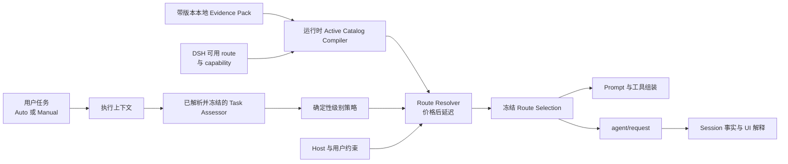

<!--
translation-source: docs/architecture.md
translation-source-blob: 02924c7de454ec347f5d9fb622aeee5beac7e4de
translation-status: current
-->

# 系统架构

[English](../architecture.md)

## 状态

ADR-011 至 ADR-014 下已接受的方向。已验证 DSH seam 和 fork 要求继续记录在 [DSH 集成证据](dsh-integration.md)中。

## 原则

1. 正常 route 决策由 DSH Host 中的确定性策略拥有。
2. Artificial Analysis 提供外部能力、价格和延迟数据；它看不到任务，也不输出最终 route。
3. 版本化 assessor policy 解析并冻结一条适合当前环境的 classifier route；该 Task Assessor 输出结构化任务属性，不输出模型名。
4. 面向用户的处理级别是 `light`、`standard` 和 `deep`；它们是启发式资源投入级别，不是质量保证。
5. 可执行 Host route identity 与 AA evidence identity 相互独立；显式版本化 binding 连接二者，不建立通用 variant/effort ontology。
6. Host capability 与用户约束先过滤 candidate，再比较价格。
7. 一次模型调用在依赖 provider 的组装与 `agent/request` 之间消费同一冻结选择。
8. 持久化 Session 事实而非临时 UI 状态，是 Auto 选择和原因的 source of truth。

## 组件



### AA Evidence Pack

本地 Evidence Pack 包含四个可独立版本化、校验和计算 SHA-256 digest 的组件：`aa-snapshot/v2`、`aa-binding-registry/v1`、`aa-route-policy/v1` 与 `aa-evidence-pack-manifest/v1`。Snapshot 扫描获取结果的每一页，并保留每条 capability 与 price 对 policy 有效的唯一 record，不依赖当前 Host inventory 或 binding availability。Registry 保存 provider normalization rule 与长期精确 mapping；Manifest 绑定组件 digest、`aa-evidence-pack-runtime/v1` 兼容性与 rights mode。

维护的合成结构见 [`examples/aa-evidence-pack.example.json`](../../examples/aa-evidence-pack.example.json)。`internal-only` 模式下，真实 acquisition、pack、report、rollback artifact、credential 与 grant document 都保存在被 Git 忽略的 `local/` 目录。Runtime 绝不调用 AA。私有文件边界强制路径 containment、有界 JSON、`0600` mode、组件与 predecessor digest、原子替换和经校验 rollback。

### Host Route Identity Builder

在 catalog 匹配前物化每条 DSH route 的可执行 identity：

```ts
interface HostRouteIdentity {
  routeId: string
  provider: string
  model: string
  effectiveConfigFingerprint: string
}
```

Fingerprint 覆盖每个会改变执行语义且已由 Host 物化的请求选项。Reasoning effort 是可选且由 provider 拥有。即使 model name 相同，实际配置不同的两条 route 也不能共享 identity。

### Evidence Route Identity 与 Binding Registry

完整执行 identity 与可复用 evidence identity 相互独立：

```ts
interface EvidenceRouteKey {
  schemaVersion: 1
  providerNamespace: string
  modelKey: string
  evidenceControls: Readonly<Record<string, string | number | boolean>>
}

interface AAEvidenceBinding {
  evidenceRouteKey: EvidenceRouteKey
  aaRecordId: string
  ruleVersion: string
  matchBasis: readonly string[]
  limitations: readonly string[]
  quarantine: null | { reasonCode: string }
}
```

每条 provider rule 精确声明 provider ID、model alias，以及只会选择不同 AA evaluated record 的 control。不存在通用必填 control。Rule 还可声明从稳定 AA record ID 到 canonical model key 与 evidence control 的 `aaRecordMappings`。Refresh 期间，`aa-binding-candidate-compiler/v1` 只有在该精确稳定 record 存在且 EvidenceRouteKey 未被占用时才物化新 binding；相同已评审 binding 会复用，缺失、冲突或跨 rule 歧义声明会作为 AMBER 隔离。Compiler 不检查 Host availability，也绝不使用 record name、slug、similarity、discovery order 或猜测的 latest record。当前 Host route 推导出精确 key 时 binding 为 active；没有 route 时为 dormant；语义完整性异常阻止使用时为 quarantined。Snapshot refresh 更新 metric 时不重写稳定 binding。

### 运行时 Active Catalog Compiler

每个用户 turn 中，Runtime 校验兼容 Evidence Pack，物化当前 DSH route，推导精确 EvidenceRouteKey，与未 quarantine 的 Registry binding 及存在的 Snapshot record 求交集，再应用 Route Policy。Active Catalog 是确定性 runtime value，不是维护或分发 artifact：

```ts
interface AAEvidenceCatalogEntry {
  routeId: string
  provider: string
  model: string
  effectiveConfig: Readonly<Record<string, unknown>>
  effectiveConfigFingerprint: string
  evidenceRouteKey: EvidenceRouteKey
  evidenceRouteKeyId: string
  aaSnapshotId: string
  aaRecordId: string
  bindingRegistryVersion: string
  evidenceBinding: AAEvidenceBinding
  aaRecord: Readonly<Record<string, unknown>>
}

interface AAEvidenceCatalogExclusion {
  source: 'host-route' | 'binding'
  hostRouteId?: string
  bindingIndex?: number
  reasonCode: string
}
```

畸形、unbound、quarantined、record 缺失或不兼容 route 以稳定 reason code 排除，不使无关 route 失效。Entry、binding state 与 exclusion 确定性排序。新添加 Host route 在精确 dormant binding 与当前 record 都存在时立即激活；仅执行 default 变化会改变 ExecutionFingerprint，但保留 EvidenceRouteKey。

已完成的阶段 1 policy compiler 输出冻结 entry，其中包含 `handlingLevel`、`aaCapabilityScore`、`aaPrice` 和可为 null 的 `aaLatencySeconds`。`aa-route-policy/v1` 固定 Intelligence Index 方法版本 `v4.1.1`、Light `<35`、Standard `35–<50`、Deep `>=50`、AA 7:2:1 混合价格字段和首次实际答案 token 中位时间。Capability 或 price 缺失时排除 route；同价时，缺失 latency 排在有测量值之后。

### Task Assessor

`task-assessor-route-policy/v1` 在不检查用户任务内容的情况下，把分类视为固定 Light 请求。它从当前冻结 AA catalog 中筛选 AA 报告的首次实际答案 token 中位时间不超过 6 秒的 route，依次尝试 Light、Standard、Deep，并在第一个存在合格项的级别中沿用价格、延迟和稳定 route identity 排序。已物化 control 与固定 assessor temperature、输出、工具或 stop 契约冲突的 candidate 会被跳过，而不是被修改。它在一次调用前冻结选中的 Host route identity 和兼容实际配置。Catalog 缺失或无效、或者没有合格 route 时，产生显式 Deep fallback，而不是硬编码或静默替换 provider/model/effort。

`task-assessor-contract/v1` 只发送当前可见用户消息、有限的可见用户／助手文本尾部和有限附件 metadata。它排除 system/developer prompt、隐藏推理、tool 流量、terminal 输出、credential、环境变量和附件内容。调用不带工具、不重试，temperature 为 `0`，输出最多 512 token，response 上限 8 KiB，总 deadline 为 12 秒。

不可信 response 必须是一个严格 JSON object，包含 task kind、scope、complexity、risk、verifiability，置信度只能是 `0`、`0.5`、`0.8` 或 `1`，并带 1–4 个 allowlist reason code。Host 附加 `task-assessor/v1`；provider、model、effort、route、handling level、额外字段、JSON 外 prose 或畸形 JSON 都会使结果无效。置信度低于 `0.8`、timeout、provider failure、结构无效、input/output 超限或 route 不可用时，返回映射到 `deep` 的 unknown assessment。

Task 5 通过一次直接 `ctx.llm.stream()` 调用执行冻结 route。它不传工具，不进入 agent loop 或 retry plugin，转发 caller cancellation，并让每次 stream pull 独立与总 deadline 竞争，因此不配合的 stream 也不能延长契约。只有 text delta 加成功 stop 才进入判断；tool call、截断、运行失败或不支持的终止状态都会 fail closed。

### 确定性级别策略

`task-handling-policy/v1` 把一个已校验 Task Assessment 映射到处理级别。未知 task kind、广泛或未知 scope、高或未知 complexity、高或未知 risk、none 或未知 verifiability，以及保守语义 reason code 选择 Deep。只有有界、低复杂度、低风险、可机械验证，且不存在多步骤、跨文件或部分验证证据的工作选择 Light。其他所有有效形态选择 Standard。同一结构化输入和 policy version 始终产生相同级别、有序 reason code 与解释。

### Route Resolver

按以下条件过滤冻结 catalog：

1. 所选任务处理级别；
2. 当前 Host route inventory 与精确配置物化；
3. model context、modality、tool 和适用执行配置 support；
4. 用户 allow/deny 限制；
5. Host security 要求。

之后按 AA price、AA latency 和稳定 route identity 排列 candidate，不使用 token cost estimator。

所选级别没有 candidate 时，可以升级到下一级。catalog 无法解析任何 route 时，可以使用配置且通过 Host 验证的 Deep fallback，并明确显示 fallback 原因；否则解析失败必须可见。

### Route Selection Coordinator

在依赖 provider 的组装前运行并冻结：

```ts
interface FrozenRouteSelection {
  decisionId: string
  handlingLevel: 'light' | 'standard' | 'deep'
  provider: string
  model: string
  effort?: string
  effectiveConfigFingerprint: string
  aaSnapshotId?: string
  aaRecordId?: string
  evidenceBindingVersion?: string
  reasonCodes: readonly string[]
  explanation: string
  policyVersion: string
  assessorVersion: string
  catalogVersion: string
  fallback: boolean
}
```

同一 provider/model/实际配置到达 prompt assembly、`agent/request`、持久化 Session 事实和 Web UI。

Task 6 把该边界实现为 `auto-decision/v1`。在每个 DSH 用户 turn 的首次 `agent/prepare-step`，插件会枚举当前 provider/model/effort inventory，或应用明确配置的 Host-route allowlist，再让 `ctx.llm.resolveCallConfig()` 物化每个 candidate。只有精确物化 route identity 才能连接离线 AA catalog；畸形、无法解析、未匹配或不允许的 route 均不能进入 resolution。Runtime discovery 只具有建议性，配置校验不宣称远程 authentication 或 transport 必然成功。

Coordinator 只运行一次 one-shot assessor 与 resolver，之后在同一 turn 的后续所有 step 中复用深度冻结结果。Resolution 从请求档位开始，只能向上移动。配置的 Deep fallback 只有在其精确物化 identity 仍属于 Host-valid 集合时才有资格；它不携带 AA snapshot 或 record 声明。既没有 AA match 也没有有效 fallback 时，coordinator 持久化结构化 failure，并在 provider dispatch 前拒绝该 step。

已解析决策使用必需 `dsh-auto-mode/selection` schema version 2；失败使用必需 `dsh-auto-mode/resolution-failure` schema version 1。Selection payload 把完整实际配置绑定到 route ID 与 fingerprint，并记录 assessment audit、请求和实际级别、AA 与 fallback 依据、evidence 和 policy 版本、reason code 与解释。Append-time parser 会拒绝 identity、原型 tier、evidence basis 不一致或 reason 重复的事件。Session projection 在 warm 与 cold reconstruction 中折叠同一组事实。维护 client 仅在回放现有 Session 时映射 schema v1 的 `fast`/`standard`/`strong` 值；schema v2 绝不发布这些值。

### Session Projection 与 UI

Session 按因果顺序记录触发用户消息、冻结选择或明确 failure、发生 dispatch 时的实际 request header，以及最终助手回复。UI 显示：

- 处理级别；
- 实际模型和适用执行配置；
- 模型／配置变化动画；
- AA 驱动或 fallback 解释；
- 检查详情中的快照和策略版本。

Manual 模式绕过 Auto 决策逻辑，并保留正常 DSH 验证。

## 请求流程

```text
1. 用户在 Auto 模式提交任务。
2. Host 收集有限任务上下文。
3. 版本化 assessor policy 解析并冻结一条合格 route；Task Assessor 返回结构化属性。
4. 确定性策略选择 Light、Standard 或 Deep。
5. Catalog compiler 或缓存的冻结 catalog 提供 AA 匹配 route。
6. Resolver 排除 Host 无效 route。
7. Resolver 选择 AA 价格更低者，再比较 AA 延迟和稳定 route ID。
8. Coordinator 冻结具体 provider/model/实际配置与解释。
9. 依赖 provider 的 prompt 和工具按该选择组装。
10. agent/request 应用同一选择。
11. Session 持久化选择和实际请求事实。
12. UI 显示级别、实际 route、变化与原因。
```

## 失败流程

```text
assessor 不确定或无效 → Deep
所选级别为空 → 升级一级
AA catalog 无效或未匹配 → 配置的 Deep fallback
fallback 不可用或 Host 无效 → 明确 no-route failure
选择 Manual → 绕过 Auto，使用正常 DSH 路径
```

Fallback 不继承未匹配的 AA 声明。界面将其显示为配置 fallback，而不是 AA 中最便宜或最强 route。

## 后续控制面

### 自适应执行

运行时 signal 后续可以触发 `light → standard → deep` 升级。重新判断需要明确任务或 phase 证据。降级是独立能力，本架构不默认承诺。

### 恢复

Recovery Supervisor 继续作为消费形式化事件的 Host 组件。Continue、Salvage 和 Restart 只在现有恢复与 effect capability 决策允许时实现。

### 委派

父 Agent 提议语义约束。Host policy 根据同一任务级别和 catalog 解析；默认仍不允许绕过具体 provider/model。

## DSH 集成

维护者 fork 提供 MVP 使用的 A1 pre-assembly 与 A2 Session-event seam。下一步复用这些 seam，改变产品策略、catalog matching 和 UI 术语，不增加另一个 DSH scheduler 或 Router Agent。
