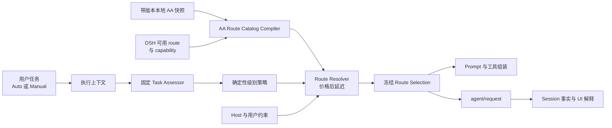

<!--
translation-source: docs/architecture.md
translation-source-blob: 4e7d690cbf45f71275314b02e844f11ebec83006
translation-status: current
-->

# 系统架构

[English](../architecture.md)

## 状态

ADR-011 下已接受的方向。已验证 DSH seam 和 fork 要求继续记录在 [DSH 集成证据](dsh-integration.md)中。

## 原则

1. 正常 route 决策由 DSH Host 中的确定性策略拥有。
2. Artificial Analysis 提供外部能力、价格和延迟数据；它看不到任务，也不输出最终 route。
3. 固定 Task Assessor 输出结构化任务属性，不输出模型名。
4. 面向用户的处理级别是 `light`、`standard` 和 `deep`；它们是启发式资源投入级别，不是质量保证。
5. 可执行 Host route identity 与 AA evidence identity 相互独立；显式版本化 binding 连接二者，不建立通用 variant/effort ontology。
6. Host capability 与用户约束先过滤 candidate，再比较价格。
7. 一次模型调用在依赖 provider 的组装与 `agent/request` 之间消费同一冻结选择。
8. 持久化 Session 事实而非临时 UI 状态，是 Auto 选择和原因的 source of truth。

## 组件



### AA Snapshot Source

提供 catalog 使用的带版本、本地、最小化 AA 记录快照。首版由维护者手工维护并被 Git 忽略。后续获取工具可以在 runtime 路径外更新它；运行时路由不依赖实时 AA 请求。

### Host Route Identity Builder

在 catalog 匹配前物化每条 DSH route 的可执行 identity：

```ts
interface HostRouteIdentity {
  routeId: string
  provider: string
  model: string
  effectiveConfigFingerprint: string
}
```

Fingerprint 覆盖每个会改变执行语义且已由 Host 物化的请求选项。Reasoning effort 是可选且由 provider 拥有。即使 model name 相同，实际配置不同的两条 route 也不能共享 identity。

### AA Evidence Binding Registry

提供从 Host route identity 到一个冻结 AA snapshot 中稳定记录的经过评审、带版本映射：

```ts
interface AAEvidenceBinding {
  bindingVersion: string
  hostRouteId: string
  effectiveConfigFingerprint: string
  aaSnapshotId: string
  aaRecordId: string
  matchBasis: readonly string[]
  limitations: readonly string[]
}
```

Binding 可以引用 family、version、variant、effort、date、provider 或其他 metadata，但不存在跨 provider 的固定必填子集。Runtime 名称相似性绝不创建 binding。Snapshot refresh 显式校验 binding 新增、替换与移除，不再自动选择最新重复记录。

### AA Route Catalog Compiler

把当前 DSH route 清单与已验证 AA evidence binding 连接。每条 catalog entry 包含：

```ts
interface AARouteCatalogEntry {
  routeId: string
  provider: string
  model: string
  effort?: string
  effectiveConfigFingerprint: string
  evidenceBinding: AAEvidenceBinding
  handlingLevel: 'light' | 'standard' | 'deep'
  aaPrice: number
  aaLatency?: number
  capabilityFacts: readonly string[]
}
```

Compiler 排除未匹配 route 和不能满足已声明 capability 的 route。档位分配是从 AA 能力分数推导、带版本的 policy data。

### Task Assessor

使用 Auto 递归之外的固定模型配置。它接收当前任务的有限描述，返回 task kind、scope、complexity、risk、verifiability、confidence 和简短 reasons。它没有工具，也不能选择具体模型。

超时、失败、结构无效或低置信度产生 unknown assessment，并映射到 `deep`。

### 确定性级别策略

把 Task Assessment 与 Host 认可的约束映射到一个处理级别。同一结构化输入和 policy version 始终产生相同级别与 reason code。

### Route Resolver

按以下条件过滤冻结 catalog：

1. 所选任务处理级别；
2. provider availability 和 credential；
3. model context、modality、tool 和适用执行配置 support；
4. 用户 allow/deny 限制；
5. Host security 要求。

之后按 AA price、AA latency 和稳定 route identity 排列 candidate，不使用 token cost estimator。

所选级别没有 candidate 时，可以升级到下一级。catalog 无法解析任何 route 时，可以使用配置且通过 Host 验证的 Deep fallback，并明确显示 fallback 原因；否则解析失败必须可见。

### Route Selection Coordinator

在依赖 provider 的组装前运行并冻结：

```ts
interface FrozenRouteSelection {
  decisionId: string
  handlingLevel: 'light' | 'standard' | 'deep'
  provider: string
  model: string
  effort?: string
  effectiveConfigFingerprint: string
  aaSnapshotId?: string
  aaRecordId?: string
  evidenceBindingVersion?: string
  reasonCodes: readonly string[]
  explanation: string
  policyVersion: string
  assessorVersion: string
  catalogVersion: string
  fallback: boolean
}
```

同一 provider/model/实际配置到达 prompt assembly、`agent/request`、持久化 Session 事实和 Web UI。

### Session Projection 与 UI

Session 按因果顺序记录触发用户消息、冻结选择、实际 request header 和最终助手回复。UI 显示：

- 处理级别；
- 实际模型和适用执行配置；
- 模型／配置变化动画；
- AA 驱动或 fallback 解释；
- 检查详情中的快照和策略版本。

Manual 模式绕过 Auto 决策逻辑，并保留正常 DSH 验证。

## 请求流程

```text
1. 用户在 Auto 模式提交任务。
2. Host 收集有限任务上下文。
3. 固定 Task Assessor 返回结构化属性。
4. 确定性策略选择 Light、Standard 或 Deep。
5. Catalog compiler 或缓存的冻结 catalog 提供 AA 匹配 route。
6. Resolver 排除 Host 无效 route。
7. Resolver 选择 AA 价格更低者，再比较 AA 延迟和稳定 route ID。
8. Coordinator 冻结具体 provider/model/实际配置与解释。
9. 依赖 provider 的 prompt 和工具按该选择组装。
10. agent/request 应用同一选择。
11. Session 持久化选择和实际请求事实。
12. UI 显示级别、实际 route、变化与原因。
```

## 失败流程

```text
assessor 不确定或无效 → Deep
所选级别为空 → 升级一级
AA catalog 无效或未匹配 → 配置的 Deep fallback
fallback 不可用或 Host 无效 → 明确 no-route failure
选择 Manual → 绕过 Auto，使用正常 DSH 路径
```

Fallback 不继承未匹配的 AA 声明。界面将其显示为配置 fallback，而不是 AA 中最便宜或最强 route。

## 后续控制面

### 自适应执行

运行时 signal 后续可以触发 `light → standard → deep` 升级。重新判断需要明确任务或 phase 证据。降级是独立能力，本架构不默认承诺。

### 恢复

Recovery Supervisor 继续作为消费形式化事件的 Host 组件。Continue、Salvage 和 Restart 只在现有恢复与 effect capability 决策允许时实现。

### 委派

父 Agent 提议语义约束。Host policy 根据同一任务级别和 catalog 解析；默认仍不允许绕过具体 provider/model。

## DSH 集成

维护者 fork 提供 MVP 使用的 A1 pre-assembly 与 A2 Session-event seam。下一步复用这些 seam，改变产品策略、catalog matching 和 UI 术语，不增加另一个 DSH scheduler 或 Router Agent。
